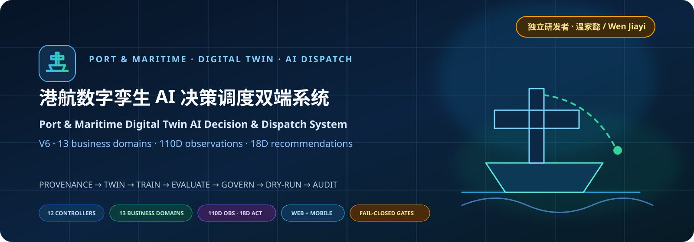
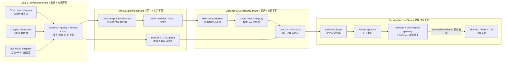
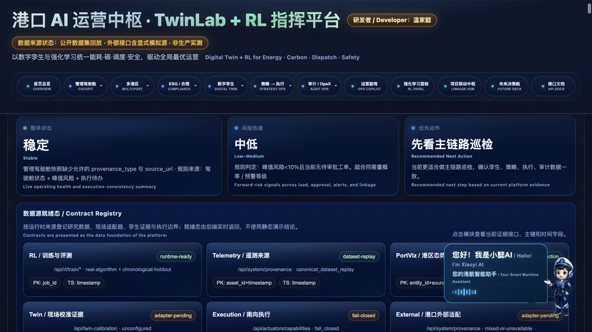
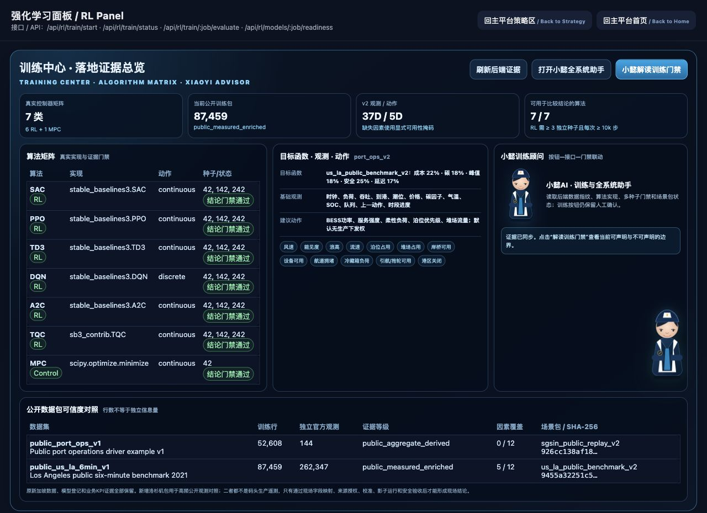
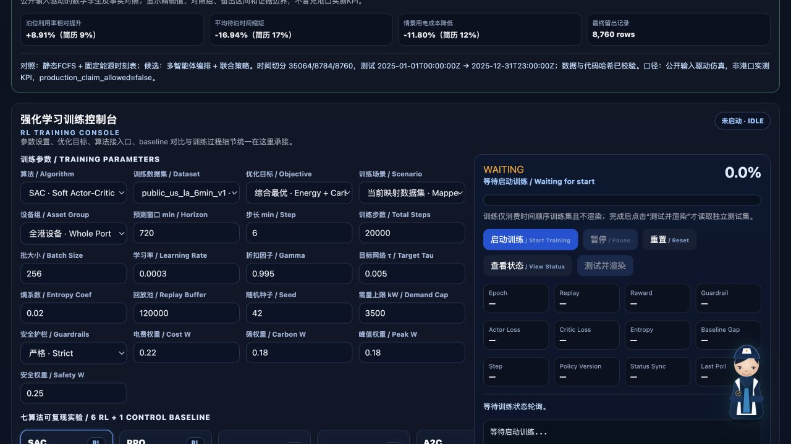
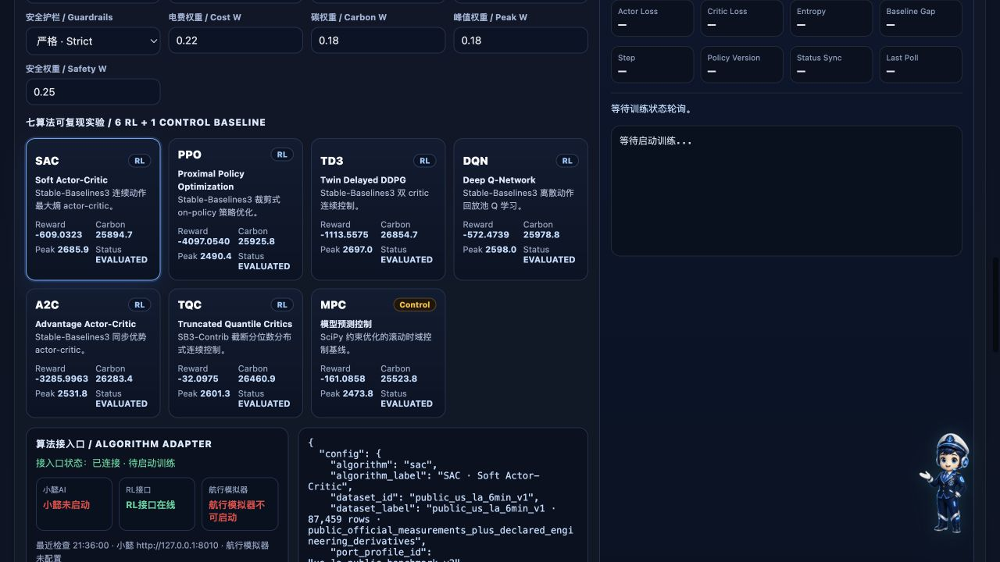
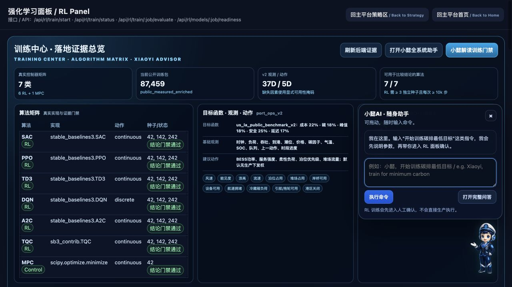

<p align="center">
  
</p>

<p align="center">
  <a href="https://github.com/wenjiayi123/port-dt-multi/actions/workflows/ci.yml"></a>
  <a href="LICENSE"></a>
  
  
  
  
</p>

<p align="center">
  <strong>可审计港口 AI 生命周期平台：从数据来源、数字孪生、真实训练和留出评测，到模型治理、受控干预与证据回放。</strong><br />
  <em>An auditable port-AI lifecycle platform spanning provenance, digital twins, real training, held-out evaluation, model governance, bounded intervention, and evidence replay.</em>
</p>

## V3.1 · Multi-port public reference training and Shanghai target training

V3 保留全部历史基准并新增一条更严格的证据链：洛杉矶六分钟公开观测承担高频对照训练，新加坡官方聚合数据保留长周期覆盖，上海新数据包则把交通运输部 22 个吞吐锚点与洋山附近 17,544 小时公开再分析对齐并独立训练。当前权重未跨港继承，因此不宣称迁移学习。尚未公开的 TOS、岸桥、堆场、AGV 和闸口字段始终标记为工程派生或不可用，等现场数据按契约替换。

V3 keeps every historical benchmark and adds a stricter evidence track: Los Angeles six-minute public observations provide high-frequency reference training, Singapore official aggregates retain long-horizon coverage, and a Shanghai package combines 22 Ministry of Transport throughput anchors with 17,544 hourly public reanalysis observations near Yangshan for independent target-domain training. We do not claim transfer learning because weights are not inherited across ports. Missing TOS, crane, yard, AGV and gate fields remain explicit engineering derivatives or unavailable factors until site replacement.

Open the new evidence-driven decision center after startup: <http://127.0.0.1:8000/v3>

| V3 fact | Current contract |
|---|---|
| Algorithm coverage | 10 executable RL methods + MPC + neutral FCFS |
| Time isolation | 70% train / 10% validation / 20% untouched blind test |
| Shanghai target package | 17,544 hours + 22 official reporting anchors; SHA-256 pinned |
| Advantage claim | Version-pinned five-metric comparison; validation selects the algorithm, then 3 seeds × ≥10,000 steps × 10 untouched blind windows report the result |
| Selected SAC blind-test result | Weighted advantage **+3.98%** (95% CI **+2.71% to +4.91%**); throughput **+9.63%** and delay improvement **+19.30%** versus neutral FCFS |
| Equivalent-throughput value | Cost/TEU **+4.53%** and carbon/TEU **+4.57%** improvement; annualized values are mechanical 48-hour extrapolations, not audited group savings |
| Causal environment | `port_ops_v3` couples service/allocation gains to operational electric load; cross-version comparison is rejected |
| 3D runtime chain | Continuous calibrated public replay → fitted Ridge P10/P50/P90 → hash-verified SAC inference → control projection and software safety envelope |
| Offline visual runtime | Repository-bundled ECharts + zero-CDN perspective Canvas twin; a first clone keeps charts, assets and three-state linkage without public JS CDNs |
| Scenario coverage | 9/10 offline executable or fail-closed classes; cyber/actuator faults remain site-adapter and hardware-in-the-loop work |
| Clickable evidence | Six business-value views; every controller exposes optimizer traces, runs, seeds, steps, KPI means/95% CIs, job/model hashes; every port exposes source lineage; every business domain exposes state, action, hard constraints, site KPIs and code paths |
| Production authority | Disabled until site mapping, calibration, shadow operation and human approval pass |
| Historical evidence | Append-only; V1/V2 registry, bundles and run manifests are retained |

### V3.2 · 小懿AI 数字孪生任务副驾

小懿现在不再只是页面悬浮问答。它在回答前由后端组装一份带 SHA-256 的运行上下文：公开数据校准回放、数据质量、Ridge P10/P50/P90 预测、选中 SAC 模型/数据哈希、异常、PSI 漂移、准入门和缺失现场因子。前端可一键发起“当前态势、未来风险、策略解释、告警分诊、交接班、执行预演”六类任务。

真实调用不由一个“Online”文案代替：服务必须同时通过 `/health` 和 OpenAPI `POST /api/chat` 能力校验，每次任务都显示 `true_xiaoyi_called`、执行 provider/model、耗时与上下文接地校验。如果小懿只复述提示词或没有引用足够的当前运行锚点，前端仍如实标明已调用，但一线答案改由后端证据护栏生成。交接班默认只预览，人工确认后才追加审计留痕；所有路径均保持 `production_authority=false`。

按默认端口启动后打开：<http://127.0.0.1:8000/ops-copilot?mission=situation>。如需真实调用独立小懿服务，请将 `XIAOYI_AI_BASE_URL` 指向其实际监听端口；当前仓库不将另一个项目的本机绝对路径写入开源默认配置。

### 五个专项 V3.1 证据轨 / Five asset-specific V3.1 evidence tracks

五个专项 V3.1 晋级策略均为**带安全投影的教师策略蒸馏**：网络通过教师动作的均方误差学习，再用固定验证集的奖励、业务与安全门禁选检查点。V3.1 岸电/场内储能中的 Stable-Baselines3 PPO 只承担策略网络与确定性推理载体。V3.2 岸电追加实验则真实执行了 3 种子 × 30,000 个 PPO 环境步，但因成本、碳、峰值综合门未通过而拒绝晋级；场内储能的新增纯电网侧档案继续采用验证选模和 2026 前向验收。全港 `port_ops_v3` 的 10 类算法仍是独立的真实环境交互式 RL 训练，各证据轨不混称。

| 专项模块 | 后端合同与盲测 | 当前公开/工程场景结果 | 不越界声明 |
|---|---|---|---|
| 岸电储能 | 34 状态 / 2 动作 / 8 奖励项 / 12 硬约束；3/3 种子收敛，20 个盲测窗 | 成本 **-0.648%**、峰值 **-1.436%**，但碳 **+0.219%**；碳门禁明确阻断 | 公开数据工程场景；不是上海港实测节省或碳核证 |
| 场内储能 | 40 状态 / 2 动作 / 9 奖励项 / 15 硬约束；3/3 种子收敛，20 个盲测窗 | 成本 **-3.440%**、峰值 **-0.021%**、碳 **-0.008%**、工程事件履约 **100%** | DR/备用事件是工程日历，不是市场结算记录 |
| 暖通空调 | 30 状态 / 3 动作 / 8 奖励项 / 12 硬约束；3/3 种子收敛，8 个盲测窗 | 成本 **-2.698%**、能耗 **-2.862%**、峰值 **-1.984%**、碳 **-2.860%**，冷量满足 **100%** | 5,760 行时序工程回放；待接 BMS/BA、冷机和末端实测点位 |
| 场桥 | 36 状态 / 2 动作 / 9 奖励项 / 16 硬约束；3/3 种子收敛，8 个盲测窗 | 成本 **-3.148%**、能耗 **-3.714%**、碳 **-3.711%**，作业量与 SLA 保持 **100%** | 92,160 条设备记录与 8,559 个作业是可复现工程遥测；待接 TOS/PLC |
| 堆场照明 | 42 状态 / 3 动作 / 10 奖励项 / 17 硬约束；3/3 种子收敛，5 个盲测窗 | 成本 **-1.770%**、能耗 **-2.175%**、峰值 **-1.207%**，最低/关键照度合规 **100%** | 公开气象/港口信号增强工程回放；待接照度计、网关与回执 |

每个百分比都来自所列模块的时序隔离盲测，不是前端定时器。前端按钮可继续下钻到原始检查点、收敛判据、状态/动作/奖励/约束、模型哈希、历史运行、失败门禁和待接现场字段。年化金额与碳量仅是固定场景的机械外推，代码和界面均保持 `claim_eligible=false`、`production_authority=false`。

### V3.2 · 业务价值追加训练与前向门禁

V3.2 没有把“继续训练”理解为必须制造更大的数字。候选先在既有训练/验证段选模，随后才打开独立的 2026 年 1–5 月上海公开前向包；失败候选写入追加式证据但不替换冠军。前向包包含交通运输部 4 个累计吞吐量锚点与洋山附近 3,624 小时公开再分析/模型记录，数据集 SHA-256 为 `616fe7cde24695f0d19118c64d1e5c534f9adee47a886b33b6003e7e372bb06a`。它仍不是码头表计或设备遥测。

| 模块 | V3.2 动作 | 验收结果 | 当前决定 |
|---|---|---|---|
| 堆场照明 | 复核可行动作与照度安全教师上限 | 演员与教师验证成本仅差 0.000027 个百分点；继续调暗只增加投影依赖 | 不重训，保留 V3.1 冠军 |
| 暖通空调 | 扩展到安全层已有的低负荷 650 Pa 静压边界；3 新种子训练 | 成本/能耗/碳改善至 3.262%/3.553%/3.549%，但峰值 1.973% 未过预设 2.0% 门 | 候选留痕，不晋级 |
| 岸电储能 | V3.1 热启动后执行 90,000 个真实 PPO 环境步 | 0/3 种子同时满足成本、碳、峰值非劣 | 拒绝综合候选，经济档案保留且碳门继续阻断 |
| 场内储能 | 禁用无公开结算证据的 DR/备用收入；3 新种子重训 | 2026 前向 3/3 通过：成本 0.0109%–0.0356%、碳 0.0058%–0.0225%、峰值 0.0378%–0.4934% | 新增纯电网侧保守档案，不覆盖历史工程事件场景 |

前端每个相关模块新增“查看V3.2增训结论”按钮，可直接查看晋级/拒绝原因、训练步数/样本数、前向指标范围、模型哈希和声明边界。完整机器可读证据位于 [`evidence/v3/value_improvement_v32.json`](evidence/v3/value_improvement_v32.json)，2026 数据卡见 [`docs/DATASET_CARD_public_cn_sha_forward_2026m05_v1.md`](docs/DATASET_CARD_public_cn_sha_forward_2026m05_v1.md)。所有金额仍是工程场景机械年化，不是集团财务实绩。

五个专项模块还各自展示两项可审计的蒸馏过程指标：教师动作模仿损失与蒸馏检查点的固定验证集平均回报。后者不是训练时的 PPO/SAC 奖励。前端直接读取追加式 `seed_*/metrics.jsonl`，合计展示 114 个持久化检查点（岸电 27、场内储能 24、暖通 24、场桥 21、照明 21）；三条彩色线是三个随机种子的原始轨迹，粗白线只是同 epoch 算术均值。过程图明确记录 `retrained_for_display=false`、`interpolated_points=false`、`frontend_random_noise=false`，点击“查看蒸馏/验证判据”可核对训练类型、文件路径、记录数和 SHA-256。

为补足“能看到奖励函数收敛过程”的可审计证据，每个专项模块还新增一张高密度奖励图。`scripts/export_checkpoint_reward_replay.py` 不重新训练模型，而是逐一加载上述 114 个保存检查点，在固定验证集首个相同窗口做确定性无渲染回放，每 10 个环境步聚合一次真实奖励，并减去同种子、同场景块的 epoch-1 奖励。五个模块共展示 2,832 个奖励块（岸电 459、场内储能 408、暖通 936、场桥 819、照明 210）；彩色细线保留三种子波动，发光白线显示同检查点均值。该证据明确标记为后训练检查点回放（`training_time_log=false`），不会冒充历史上未保存的逐优化步奖励，也不读取封存盲测；原始奖励、模型路径、检查点 SHA-256 和声明边界均可由“查看收敛判据”按钮下钻核对。

Detailed evidence: [V3 technical map](docs/V3_TECHNICAL_EVIDENCE.md) · [runtime data/model contract](docs/V3_RUNTIME_DATA_CONTRACT.md) · [HR technical audit](docs/V3_HR_TECHNICAL_AUDIT.md) · [Shanghai dataset card](docs/DATASET_CARD_public_cn_sha_hourly_v3.md) · [site-data replacement contract](docs/SITE_DATA_REPLACEMENT_CONTRACT_V3.md).

V3.2 adds a paired strong-baseline gate. The selected three-seed SAC ensemble is compared on the same ten chronological blind windows with FCFS neutral control, a fixed transparent engineering SOP proxy, and receding-horizon MPC. SAC retains a strict advantage over FCFS but does not beat the engineering proxy or MPC on the fixed weighted objective, so production and group-savings admission remain closed. The proxy is not presented as measured incumbent Shanghai operations; site SOP and timestamped action/outcome logs must replace it.

The twelve business-domain cards also disclose execution depth. Nine domains currently expose a model, sandbox, safety/workflow, evidence or transfer output; gate/rail/barge, reefer and maintenance are explicitly marked as simulation-contract, coupled-factor or monitoring-only domains with no independent optimizer. Every card exposes runtime APIs, code hashes, site blockers and its fail-closed fallback; all twelve remain production-pending.

<p align="center">
  <strong>研发作者：</strong>温家懿 · <strong>Research Author:</strong> Wen Jiayi
</p>

<p align="center">
  <a href="#-系统全景--system-at-a-glance">系统全景 / Overview</a> ·
  <a href="#-快速开始--quick-start">快速开始 / Quick start</a> ·
  <a href="#-真实训练与评测--real-training--evaluation">训练与评测 / Evaluation</a> ·
  <a href="#-数据与接港契约--data--port-adapter-contract">数据契约 / Data</a> ·
  <a href="#-安全和治理边界--safety--governance-boundaries">安全治理 / Safety</a> ·
  <a href="docs/OPEN_SOURCE_READINESS_AUDIT.md">开源审计 / Audit</a>
</p>

<table>
  <tr>
    <th align="center">公开数据驱动记录<br /><sub>PUBLIC-DATA DRIVEN</sub></th>
    <th align="center">泊位有效利用率<br /><sub>BERTH UTILIZATION</sub></th>
    <th align="center">平均待泊时间<br /><sub>MEAN WAITING TIME</sub></th>
    <th align="center">情景用电成本<br /><sub>SCENARIO ENERGY COST</sub></th>
    <th align="center">稳定性复验<br /><sub>PAIRED BOOTSTRAP</sub></th>
  </tr>
  <tr>
    <td align="center"><strong>52,608</strong><br />小时记录 / hourly records</td>
    <td align="center"><strong>83.63% → 91.09%</strong><br />相对提升 / relative +8.91%</td>
    <td align="center"><strong>−16.94%</strong><br />5.90 h → 4.90 h</td>
    <td align="center"><strong>−11.80%</strong><br />同吞吐情景 / throughput held</td>
    <td align="center"><strong>365 × 2,000</strong><br />日级配对复验 / paired daily resampling</td>
  </tr>
</table>

<p align="center">
  <sub><strong>Evidence scope:</strong> parameter-declared digital-twin counterfactual over public MPA anchors; not a measured terminal KPI, online A/B test, or audited financial saving.</sub>
</p>

---

## 为什么是 Port DT Multi？ / Why Port DT Multi?

港口 AI 项目真正困难的部分，不是再画一张驾驶舱，而是让“数据从哪里来、算法究竟跑了什么、评测是否泄漏、策略为何允许进入下一道门、执行到底有没有发生”能够被复核。Port DT Multi 把这些问题组织成一条可本地运行、可替换数据源、可留存证据的工程主链。

The hard part of port AI is not another dashboard. It is making data origin, algorithm execution, leakage control, promotion criteria, action authority, and final evidence independently reviewable. Port DT Multi turns those concerns into a local, replaceable, evidence-producing engineering workflow.

| 能力域 / Domain | 已实现 / Implemented | 可审计证据 / Evidence |
|---|---|---|
| 数据与来源 / Data & provenance | 规范字段映射、质量门禁、单位/时区/许可元数据、SHA-256<br><sub>Canonical mapping, quality gates, unit/time-zone/licence metadata, and SHA-256</sub> | 数据卡、质量报告、数据集指纹<br><sub>Dataset card, quality report, and fingerprint</sub> |
| 港区孪生 / Port twin | 数据集确定性投影；可切换严格 JSONL 实体轨迹<br><sub>Deterministic dataset projection with switchable strict JSONL entity traces</sub> | 来源等级、帧序号、时间戳、适配器状态<br><sub>Provenance level, frame sequence, timestamp, and adapter status</sub> |
| 策略实验 / Policy lab | 10 类 RL + 滚动时域 MPC + 中性 FCFS<br><sub>Ten RL methods plus MPC and a neutral FCFS comparator</sub> | 真实库版本、随机种子、配置、优化器日志<br><sub>Runtime library, seed, configuration, and optimizer logs</sub> |
| 独立评测 / Independent evaluation | 时间顺序留出集、多窗口评测、95% 自助法区间<br><sub>Chronological holdout, multi-window evaluation, and 95% bootstrap intervals</sub> | 每轮指标、窗口索引、轨迹回放、评测协议<br><sub>Per-run metrics, window indices, replay, and protocol</sub> |
| 模型治理 / Model governance | 模型卡、产物哈希、candidate/champion/rollback/archive | 门禁阻断项、审批人、理由、审计日志<br><sub>Blocking gates, approver, rationale, and audit log</sub> |
| 运行治理 / Operational governance | OpsX、漂移/异常、来源总览、故障响应流程<br><sub>OpsX, drift/anomaly checks, provenance overview, and incident workflow</sub> | 请求 ID、健康检查、Prometheus 指标、事件证据<br><sub>Request ID, health checks, Prometheus metrics, and incident evidence</sub> |
| 受控执行 / Bounded execution | 默认关闭；白名单、参数约束、幂等、异人复核、独立二通道<br><sub>Disabled by default; allowlist, bounds, idempotency, four-eyes review, and an independent second channel</sub> | 原子审计、失败关闭、可重试回滚<br><sub>Atomic audit, fail-closed behavior, and retry-safe rollback</sub> |
| 双语交互 / Bilingual UX | 中文/English 主界面、RL 面板、运营助手、集成中枢<br><sub>Chinese/English cockpit, RL panel, copilot, and integration hub</sub> | 页面级来源状态和能力边界<br><sub>Page-level provenance state and capability boundary</sub> |

> <strong>定位 / Positioning</strong> — 这是研究、教学、软件验证与现场集成前评估平台，不是已经认证的自主港口控制器。所有推理输出默认是建议，`dispatch_allowed=false`；生产执行权始终位于独立现场审批、设备联锁与变更管理之后。
>
> This is a research, teaching, software-verification, and pre-integration assessment platform—not a certified autonomous port controller. All inference is advisory by default with `dispatch_allowed=false`; production authority remains behind independent site approval, equipment interlocks, and change management.

## 🧭 系统全景 / System at a glance



这不是把所有模块混成一个“万能 AI”。系统通过来源等级、环境隔离、注册门禁和执行权分离，让感知、实验、评测、决策建议与设备动作各自拥有清晰责任边界。

This is not a monolithic “AI that does everything.” Provenance levels, environment isolation, registry gates, and authority separation keep sensing, experimentation, evaluation, recommendations, and equipment actuation accountable to different boundaries.

<p align="center">
  
  <br />
  <sub>图 1 · 系统总览与数据契约登记：训练评测、遥测、孪生校准、南向执行和外部适配器状态同屏可核验。</sub>
</p>

## 🖥️ 产品界面 / Product surfaces

<p align="center">
  
  <br />
  <sub>图 2 · V2 历史界面证据（保留）：7 类控制器、87,459 行公开训练包与 37D/5D 环境；V3 当前 12 控制器界面请打开 <code>/v3</code>。</sub>
</p>

项目统一使用同一份透明背景“小懿 Q 版海事官”资产；训练顾问、全系统助手和页面悬浮入口不再混用旧写实 SVG。人物只承担解释、导航和受控命令编排，不绕过训练确认或设备执行门禁。

The training advisor, full-system assistant, and floating entry point now share one transparent Xiaoyi Q-style maritime-officer asset. The character explains evidence, navigates, and prepares bounded commands without bypassing training confirmation or actuation gates.

- <strong>运营总览 / Operations cockpit</strong>：港区态势、数据来源、KPI、ESG/合规、策略链与审计入口。缺少正式证据时显示“未接入/未评定”，不补造优秀指标。<br>
  *Port situation, provenance, KPI, ESG/compliance, policy chain, and audit entry points. Missing formal evidence is shown as “not connected / not assessed,” never replaced with flattering metrics.*
- <strong>强化学习面板 / RL panel</strong>：选择规范数据集和十二类控制器，读取后端真实进度，训练完成后再启动盲测与轨迹回放。<br>
  *Select a canonical dataset and one of twelve controllers, read backend-owned progress, and start blind-test evaluation and replay only after training completes.*
- <strong>运营助手 / Ops copilot</strong>：把自然语言意图映射为受支持的只读查询或白名单候选动作；不扩大调用者权限。<br>
  *Maps natural-language intent to supported read-only queries or allowlisted candidate actions without expanding caller authority.*
- <strong>集成中枢 / Integration hub</strong>：展示现场连接、功能开关和安全门；验证链运行在 dry-run，不能冒充生产下发。<br>
  *Surfaces site connections, feature flags, and safety gates. Integration verification runs as dry-run and cannot masquerade as production dispatch.*
- <strong>Story / OpsX / TwinLab</strong>：用于证据叙事、运行治理、故障注入和接港前契约联调；每类数据保持 replay、simulation、derived、measured 标签。<br>
  *Supports evidence narratives, operational governance, fault injection, and pre-integration contract testing while preserving replay/simulation/derived/measured labels.*

## 🧠 真实训练与评测 / Real training & evaluation

十二个控制器使用相同规范数据契约和评测口径，但并不伪装成相同类型：SAC、PPO、TD3、DQN、A2C 由 Stable-Baselines3 实际优化；TQC、QR-DQN、TRPO、Recurrent PPO、ARS 由 SB3-Contrib 实际优化；MPC 与中性 FCFS 是非学习比较基线。

All twelve controllers share one canonical data contract and evaluation protocol without pretending to be the same kind of method. Ten methods execute real RL optimizers, while MPC and neutral FCFS provide non-learning comparators.

面向换港的 `port_ops_v2` 提供37维观测（基础状态、12类国际港口因素和逐因素可用性掩码）与5维建议动作（BESS、服务、柔性负荷、泊位优先级、堆场流量）。既有 `port_ops_v1` 模型和指标保持可读，避免升级时丢失历史证据。港口资产容量、目标权重、安全边界和因素要求由 `config/ports/*.json` 场景包管理。

For port replacement, `port_ops_v2` exposes 37 observations (base state, twelve international-port factors, and per-factor availability masks) and five advisory actions (BESS, service intensity, flexible load, berth priority, and yard flow). Existing `port_ops_v1` models and metrics remain readable. Port assets, objectives, safety bounds, and factor requirements live in replaceable `config/ports/*.json` profiles.

V3 formal evidence uses `port_ops_v3`, which retains the 37D/5D contract while causally charging service-intensity, berth-priority and yard-flow gains to operational electric load. This prevents a policy from manufacturing a throughput gain without the corresponding energy consequence. V1/V2 manifests remain immutable historical evidence and are never mixed into a V3 comparison.

<p align="center">
  
  <br />
  <sub>图 3 · 真实训练控制台：数据集、目标权重、算法超参数、随机种子、无渲染训练与测试回放边界由后端统一承接。</sub>
</p>

| 控制器 / Controller | 类型 / Type | 动作空间 / Action space | 实现 / Implementation |
|---|---|---|---|
| SAC | off-policy actor–critic | 连续 / continuous | `stable_baselines3.SAC` |
| PPO | on-policy policy gradient | 连续 / continuous | `stable_baselines3.PPO` |
| TD3 | off-policy actor–critic | 连续 / continuous | `stable_baselines3.TD3` |
| DQN | value-based | 离散 / discrete | `stable_baselines3.DQN` |
| A2C | on-policy actor–critic | 连续 / continuous | `stable_baselines3.A2C` |
| TQC | distributional off-policy actor–critic | 连续 / continuous | `sb3_contrib.TQC` |
| QR-DQN | distributional value learning | 离散 / discrete | `sb3_contrib.QRDQN` |
| TRPO | trust-region policy optimization | 连续 / continuous | `sb3_contrib.TRPO` |
| Recurrent PPO | LSTM policy optimization | 连续 / continuous | `sb3_contrib.RecurrentPPO` |
| ARS | derivative-free random search | 连续 / continuous | `sb3_contrib.ARS` |
| MPC | rolling-horizon control | 连续约束 / constrained continuous | `scipy.optimize.minimize` |
| FCFS neutral | deterministic rule comparator | 连续中性动作 / neutral continuous | `port_dt.FCFSNeutralPolicy` |

<p align="center">
  
  <br />
  <sub>图 4 · V2 历史七算法评测登记（保留、不覆盖）；V3 新增控制器沿用相同后端证据协议。</sub>
</p>

上游实现说明： [Stable-Baselines3 A2C](https://stable-baselines3.readthedocs.io/en/master/modules/a2c.html) · [SB3-Contrib TQC](https://sb3-contrib.readthedocs.io/en/master/modules/tqc.html)。

实验隔离契约 / Experiment-isolation contract:

1. V3 数据按 70/10/20 切为训练、验证和盲测，不 shuffle；历史运行继续读取原切分协议。
2. 训练环境只能读训练段；`render()` 和轨迹收集在训练模式中被代码级禁止。
3. 模型选择不能读取最终盲测；训练完成后才由独立评测调用读取 10 个确定性窗口。
4. 产物记录数据哈希、配置、随机种子、实现版本、模型哈希和训练渲染调用次数。
5. 比较性结论至少需要 3 个不同随机种子；MPC 作为确定性非学习基线按相同窗口单独登记。

1. V3 data uses chronological 70/10/20 train/validation/blind-test isolation with no shuffle; historical manifests keep their original split semantics.
2. The training environment sees only the training segment; rendering and trace collection are prohibited in training mode.
3. A separate evaluation call reads the holdout segment only after training, using ten deterministic windows by default.
4. Artifacts record dataset hash, configuration, seed, implementation, model hash, and training render-call count.
5. Comparative RL claims require at least three distinct seeds; deterministic MPC is registered on the same windows as a controller baseline.

### 岸电储能 V3.1 专项 / Shore+BESS V3.1 track

岸电储能不再把旧的 145 条全零动作数据和单轨迹 raw component 当作收敛证据。旧 `policy.bin`、2,293 条 JSONL、2000 步曲线及其 SHA-256 全部原样保留；新的专项环境使用 `public_cn_sha_hourly_v3` 的 17,544 小时序列，按 12,280/1,755/3,509 行做训练/固定验证/盲测隔离。状态合同为 34 维，动作是 BESS 充放电与明确标记的岸电辅助柔性负荷 2 维，奖励拆为电费、碳、需量、退化、备用、岸电 SLA、安全投影和期末状态 8 项，并有 12 道硬约束。

正式运行 `python -m scripts.train_shore_bess_v3_safe`：每个随机种子从训练段生成 16,800 条安全教师样本，执行 5,280 次优化更新；3 个种子总计 15,840 次。模型选择只看固定验证窗口，最终报告读取 20 个独立 168 小时盲测窗口。当前经济策略在公开工程场景中相对无储能的成本下降约 0.648%、峰值下降约 1.436%，年化机械外推约 102.1 万元；但由于本数据的派生低谷电价与碳因子明显反向，碳排放反而约增加 252.4 吨/年，因此碳策略门禁明确为 blocked。两者都不是上海港现场实测 KPI。

The Shore+BESS track no longer treats the legacy 145 zero-action transitions or a noisy single-trajectory raw-component chart as convergence evidence. V3.1 keeps every legacy artifact unchanged, trains a 34-state/two-action constrained actor on the 17,544-hour Shanghai public scenario, selects checkpoints on fixed validation windows, and reports only after a 20-window chronological blind test. The economic profile improves modeled cost and peak, while the carbon gate remains blocked because the public scenario's derived off-peak tariff is associated with higher carbon intensity. The UI exposes both outcomes instead of relabelling the carbon increase as a reduction. See `evidence/v3/shore_bess/latest.json` and `GET /api/v3/modules/shore-bess/evidence`.

### 场内储能 V3.1 专项 / Site BESS V3.1 track

场内储能旧版 2,000 步、8,927 条 transition、SAC 权重和 SHA-256 全部保留，但其备用动作 `dR` 支持为 0、事件激活为 0、无时间盲测，且保存策略在抽样状态上饱和，因此只作为历史诊断。V3.1 使用同一 17,544 小时公开时间轴，按 12,280/1,755/3,509 行隔离训练、固定验证与盲测；合同扩展为 40 维状态、联合充放电/上调备用 2 维动作、9 项奖励和 15 条硬约束。缺失的 DR/备用市场记录按公开规则补成明确标记的工程事件日历，报告同时声明现场事件行数为 0，禁止当成上海市场出清或结算实绩。

正式运行 `python -m scripts.train_bess_energy_v3_safe`，每个种子使用 13,440 条安全教师样本、3,710 次优化更新，3 个种子合计 11,130 次；模型只在固定验证集上选型，随后读取 20 个独立 168 小时盲测窗口。当前通过版本在公开工程场景中相对无储能的综合成本下降约 3.440%、峰值下降约 0.021%、碳下降约 0.008%、工程事件履约 100%、安全违规为 0，年化机械外推差额约 541.9 万元。首个因峰值反弹而失败的正式运行也保留在追加式索引中。上述结果不是上海港财务节省、碳核证、市场结算或现场控制许可；详见 `evidence/v3/bess_energy/latest.json` 与 `GET /api/v3/modules/bess-energy/evidence`。

The Site BESS V3.1 track preserves the legacy 2,000-step/8,927-transition SAC evidence but rejects it for zero reserve-action support, zero event coverage, saturation and missing chronological evaluation. The new 40-state/two-action CMDP actor is selected on fixed validation windows and reported only after multi-seed blind testing. Reserve/DR events are explicitly engineered scenarios—not observed market settlements. Both the failed peak-regression run and the later passing run remain append-only; production authority stays false until authorized PCS/BMS/PCC, tariff, event, acknowledgement and rollback evidence is supplied.

### 暖通、场桥与堆场照明 V3.1 专项 / HVAC, yard-crane and lighting tracks

三个模块不再用浏览器拼接的静态 KPI 充当模型输出。暖通在 5,760 行 15 分钟工程回放上训练安全约束策略；场桥把 92,160 条设备遥测、8,559 个 TOS 作业和 69,120 条队列预测聚合成可复现时序合同；堆场照明把 96 个分区的 267,168 条照明记录和 953,856 条活动预测与 `public_cn_sha_hourly_v3` 的公开气象、占用、可用率、基础负荷、电价和碳因子信号对齐。三者都按 70/10/20 时间隔离、三种子选型、未参与选型的盲测、模型哈希重载推理和硬约束门禁执行；旧暖通 4,003 条历史、旧场桥 1,001 条历史及首个峰值门禁失败运行、旧照明 498 条 IQL 历史与 OOD 阻断结论全部保留。

The three additional tracks are backend-owned evidence flows rather than timer-generated KPIs. Each exposes the exact chronological dataset contract, per-seed convergence, validation-only selection, sealed blind windows, selected-model hash reload, safety projection, business non-degradation gates, append-only run history and the site fields still required for deployment. Their annualized savings and carbon figures remain engineering-scenario extrapolations; none grants live control authority or a measured port KPI claim.

可移植评测摘要保存在 [`evidence/rl`](evidence/rl/README.md)：短步数结果固定标记为 `RL_SMOKE_WIRING_ONLY`，正式RL结果必须标记为 `RL_HELD_OUT_EVALUATION`，并同时保存数据指纹、模型哈希、训练步数、随机种子、留出窗口和95%区间。模型二进制不提交到Git，可用相同脚本复现。

Portable evaluation summaries live in [`evidence/rl`](evidence/rl/README.md). Short runs remain labelled `RL_SMOKE_WIRING_ONLY`; formal RL evidence requires `RL_HELD_OUT_EVALUATION` plus the dataset fingerprint, model hash, optimizer steps, seed, holdout windows, and 95% intervals. Model binaries stay out of Git and are reproducible with the documented command.

## 📊 固定业务KPI对照 / Fixed business KPI evidence

Web端提供 `/api/rl/business-benchmark`，只展示经过数据、配置和计算代码 SHA-256 校验的固定反事实报告。`public_port_ops_v1` 以 MPA 新加坡 2020–2025 月度集装箱吞吐量和集装箱船到港量为官方锚点，构造 52,608 条连续小时驱动记录，并按 35,064 train / 8,784 validation / 8,760 test 时序隔离；最终测试相对“静态 FCFS + 固定能源时刻表”得到：

The Web endpoint `/api/rl/business-benchmark` exposes only the pinned counterfactual report whose data, configuration, and computation code pass SHA-256 verification. `public_port_ops_v1` anchors 52,608 consecutive hourly driver records to official MPA Singapore monthly container throughput and container-vessel arrivals for 2020–2025, then applies a chronological 35,064 train / 8,784 validation / 8,760 test split. Against static FCFS plus a fixed energy schedule, the sealed test produces:

| 指标 / Metric | 精确测试结果 / Exact test result | 简历整数口径 / Rounded resume claim |
|---|---:|---:|
| 泊位有效利用率 / Effective berth utilization | 83.63% → 91.09%，+7.45 个百分点 / percentage points | 相对 / relative +9% |
| 平均待泊时间 / Mean waiting time | 5.90 h → 4.90 h，-16.94% | -17% |
| 情景用电成本 / Scenario energy cost | 26.83M → 23.66M，-11.80% | -12% |

吞吐量保持一致；每天未恢复的柔性负荷与 BESS 期末电量按固定参考价结算，避免跨日借能或通过欠供制造节省。365 个完整测试日进行 2,000 次成对 bootstrap，三项指标的 95% 区间分别为 8.89%–8.97%、16.92%–16.97% 和 11.79%–11.84%；27 组预声明参数敏感性亦保存于报告。上述数字是公开输入驱动的数字孪生情景结果，不是港口实测 KPI、现场 A/B 或财务审计结论。完整公式、参数和边界见 [业务KPI基准](docs/BUSINESS_KPI_BENCHMARK.md) 与 [简历证据页](docs/RESUME_CLAIMS_WEB.md)。

Throughput is held constant. Unrestored flexible load and terminal BESS state of charge are settled daily at a fixed reference price to prevent cross-day energy borrowing or artificial savings through under-supply. Across 365 complete test days, 2,000 paired bootstrap resamples yield 95% intervals of 8.89%–8.97%, 16.92%–16.97%, and 11.79%–11.84%; the report also retains 27 predeclared parameter-sensitivity cases. These are public-input-driven digital-twin scenario results—not measured terminal KPIs, an online A/B test, or a financial audit. See the [business KPI benchmark](docs/BUSINESS_KPI_BENCHMARK.md) and [resume evidence page](docs/RESUME_CLAIMS_WEB.md) for formulas, parameters, and boundaries.

Flutter 移动端通过同一 FastAPI 的 `/api/mobile/*` 契约读取候选、提交人工表态、获取回执并上传审计，不是另一套独立后端。500项固定闭环操作验证了重复提交、冲突幂等键、越权生产下发与审计链，详见 [双端架构](docs/SHARED_WEB_MOBILE_ARCHITECTURE.md)、[移动闭环基准](docs/MOBILE_WORKFLOW_BENCHMARK.md)和[双端简历证据](docs/RESUME_CLAIMS_DUAL_FRONTEND.md)。

The Flutter frontend uses the same FastAPI `/api/mobile/*` contract to read candidates, submit human decisions, obtain receipts, and upload audit evidence; it is not a separate backend. A fixed suite of 500 closed-loop operations checks duplicate submissions, conflicting idempotency keys, unauthorized production dispatch, and the audit chain. See the [dual-frontend architecture](docs/SHARED_WEB_MOBILE_ARCHITECTURE.md), [mobile workflow benchmark](docs/MOBILE_WORKFLOW_BENCHMARK.md), and [dual-frontend resume evidence](docs/RESUME_CLAIMS_DUAL_FRONTEND.md).

```bash
python -m scripts.business_kpi_benchmark --verify
python -m scripts.release_check
```

## 🚀 快速开始 / Quick start

### 本地运行 / Local

Python 3.12 is recommended. / 建议使用 Python 3.12。

安全兼容边界：PyTorch 已锁定 2.13.0。Intel x86_64 macOS 的上游原生 wheel
停留在存在已知高危漏洞的 2.2.x，因此全新安装请使用下方 Linux 容器；不再由
`requirements.txt` 静默安装不安全的旧版本。Linux 与 Apple Silicon 可按本节原生安装。

Security compatibility boundary: PyTorch is pinned to 2.13.0. Upstream native
wheels for Intel x86_64 macOS stop at a vulnerable 2.2.x release, so fresh
installs on that legacy host must use the Linux container below. Native Linux
and Apple Silicon installations may use these commands.

```bash
git clone https://github.com/wenjiayi123/port-dt-multi.git
cd port-dt-multi
python3.12 -m venv .venv
source .venv/bin/activate
python -m pip install --upgrade pip
python -m pip install -r requirements.txt
python -m uvicorn app.server:app --host 127.0.0.1 --port 8000
```

Linux 容器和 CI 使用 `requirements-linux.lock` / `requirements-ci.lock` 与
`--require-hashes` 校验每个发行包；`requirements.txt` 保留为跨平台开发入口。
The Linux container and CI verify every distribution hash through the checked-in
lock files; `requirements.txt` remains the cross-platform development input.

打开 / Open:

- V3 决策中枢 / V3 Decision Center: <http://127.0.0.1:8000/v3>
- 主界面 / Cockpit: <http://127.0.0.1:8000/>
- 强化学习面板 / RL panel: <http://127.0.0.1:8000/rl-panel>
- 运营助手 / Ops copilot: <http://127.0.0.1:8000/ops-copilot>
- 集成中枢 / Integration hub: <http://127.0.0.1:8000/integration-hub>
- OpenAPI（开发模式）: <http://127.0.0.1:8000/docs>
- 来源总览 / Provenance: <http://127.0.0.1:8000/api/system/provenance>
- 健康检查 / Health: <http://127.0.0.1:8000/health/live> · <http://127.0.0.1:8000/health/ready>

### 容器运行 / Container

```bash
docker build -t port-dt-multi:3.2.0 .
docker run --rm -p 127.0.0.1:8000:8000 port-dt-multi:3.2.0
```

容器会打包 V3 页面、公开数据、模型哈希、历史训练证据、数据卡和复现实验脚本；CI 会实际构建镜像，并检查 `/health/ready`、V3 总览、运行策略和模块证据接口。容器默认以非 root 用户运行，且仍使用开发/研究边界。生产配置请从 [.env.example](.env.example) 和 [生产就绪清单](docs/PRODUCTION_READINESS.md) 开始。

The image packages the V3 UI, public datasets, model hashes, historical training evidence, dataset cards and reproduction scripts. CI builds the image and verifies readiness, V3 overview, runtime-policy and module-evidence endpoints. The container runs as a non-root user and retains the research/integration boundary. Start production hardening from [.env.example](.env.example) and the [production-readiness checklist](docs/PRODUCTION_READINESS.md).

## 🧪 启动一次训练 / Run one experiment

```bash
curl -X POST http://127.0.0.1:8000/api/rl/train/start \
  -H 'Content-Type: application/json' \
  -d '{
    "algorithm":"sac",
    "dataset_id":"public_port_ops_v1",
    "total_steps":20000,
    "episode_steps":48,
    "test_ratio":0.2,
    "seed":42,
    "demand_cap_kw":3500
  }'
```

使用返回的 `job_id` 查询后端真实状态，并在完成后单独评测：

Use the returned `job_id` to query backend-owned progress, then evaluate separately after completion:

```bash
curl 'http://127.0.0.1:8000/api/rl/train/status?job_id=<job_id>'
curl 'http://127.0.0.1:8000/api/rl/train/<job_id>/history'
curl -X POST 'http://127.0.0.1:8000/api/rl/train/<job_id>/evaluate' \
  -H 'Content-Type: application/json' -d '{"episodes":10}'
curl 'http://127.0.0.1:8000/api/rl/models/<job_id>/readiness'
```

确定性推理返回原始动作、约束投影后的控制建议和软件安全包络；不渲染、不自动执行：

Deterministic inference returns the raw action, constrained control recommendation, and software safety envelope; it neither renders nor dispatches:

```bash
curl -X POST 'http://127.0.0.1:8000/api/rl/train/<job_id>/predict' \
  -H 'Content-Type: application/json' \
  -d '{"state":{"base_load_kw":2300,"throughput_teu":190,"vessel_arrivals":3,"tide_m":0.4,"price_per_kwh":1.1,"carbon_kg_per_kwh":0.48,"ambient_c":31,"hour":18,"soc":0.58,"queue":10,"last_bess_kw":0}}'
```

多种子正式基准 / Multi-seed benchmark:

```bash
python -m scripts.rl_benchmark \
  --dataset public_port_ops_v1 \
  --algorithms sac,ppo,td3,dqn,a2c,tqc,mpc \
  --seeds 42,142,242 \
  --steps 20000 --episodes 10
```

## 📦 数据与接港契约 / Data & port-adapter contract

规范 CSV / Canonical CSV:

```text
timestamp,base_load_kw,throughput_teu,vessel_arrivals,tide_m,price_per_kwh,carbon_kg_per_kwh,ambient_c
```

`public_port_ops_v1` 是为了复现接口、环境和测试构造的集成数据集：公开输入为新加坡海事及港务管理局 2020–2025 月度集装箱吞吐量与集装箱船到港量，官方输入的港口地理口径一致；小时负荷、小时吞吐/到港分配、分时电价、碳因子、气温和潮位压力项是有记录的确定性工程派生量，潮位项不参与三项业务 KPI。因此该数据集<strong>不是</strong>港口小时实测时序，不能用于现场绩效归因。

更高频的 `public_us_la_6min_v1` 对照包使用美国交通部BTS洛杉矶港月度TEU和NOAA六分钟水位、气温、风速，共87,459个时步、262,347条独立原始公共观测；42条短缺口插值另行登记。未公开的码头字段仍逐项标为工程派生或不可用；数据量更大不自动等于生产可信度更高。两套数据均保留，便于比较长时间聚合锚点与高频实测环境因素。

`public_cn_sha_hourly_v3` 是上海目标域数据包：2024–2025 共 17,544 个连续小时，包含交通运输部 22 个官方吞吐报告锚点和 17,544 小时洋山附近公开气象/海洋再分析；总吞吐 1.0657 亿 TEU 在小时分配前后严格守恒。泊位、堆场、岸桥、设备、拥堵、冷藏负荷和引航拖轮字段是明确的工程派生，能见度保持不可用掩码。它用于离线适配和盲测，不代表上海码头遥测或现场 KPI。

`public_port_ops_v1` is an integration dataset for reproducible adapters, environments, and tests. Its public inputs are MPA Singapore monthly container throughput and container-vessel arrivals for 2020–2025. Hourly load, throughput/arrival allocation, tariff, carbon, temperature and tide-stress fields are documented deterministic derivatives; tide is excluded from the three business KPIs. It is <strong>not</strong> measured hourly terminal telemetry and must not be used for site-performance attribution.

`public_cn_sha_hourly_v3` is the Shanghai target-domain package. It aligns 22 official throughput reports with 17,544 public Yangshan-area reanalysis hours, preserves the 106.57 million TEU aggregate exactly, and keeps every internal terminal factor explicitly derived or unavailable. It supports offline adaptation and blind testing—not a Shanghai telemetry or field-KPI claim.

接入新港口无需改写算法，只需通过 `/api/rl/datasets/upload` 提供：

To connect another port without rewriting algorithms, upload through `/api/rl/datasets/upload` with:

- 显式字段映射 / explicit field mapping;
- `license`、`owner`、`timezone`、`intended_use` 治理元数据 / governance metadata;
- 严格递增 ISO-8601 时间和至少 48 条记录 / strictly increasing ISO-8601 timestamps and at least 48 records;
- 通过物理边界、非有限值、采样间隔和必填元数据门禁的数据 / data passing physical-bound, non-finite-value, sampling-interval, and required-metadata gates.

同名数据集默认禁止覆盖，只有显式 `replace_existing=true` 才允许替换。详细说明见 [数据与接港契约](docs/DATASET_AND_PORT_ADAPTER.md)、[数据卡](docs/DATASET_CARD_public_port_ops_v1.md) 和 [数据血缘](docs/RL_DATA_LINEAGE.md)。

Datasets cannot overwrite an existing identifier unless `replace_existing=true` is explicitly supplied. See the [dataset and port-adapter contract](docs/DATASET_AND_PORT_ADAPTER.md), [dataset card](docs/DATASET_CARD_public_port_ops_v1.md), and [RL data lineage](docs/RL_DATA_LINEAGE.md).

## 🛡️ 安全和治理边界 / Safety & governance boundaries

- <strong>来源不混淆 / No provenance blur</strong>：`dataset`、`engineering_simulator`、`live_rest`、`measured` 是不同等级；真实接口失败不会静默生成业务值。<br>
  *`dataset`, `engineering_simulator`, `live_rest`, and `measured` are distinct levels; a failed live interface never silently generates business values.*
- <strong>模型不越权 / Models have no authority</strong>：模型注册、`champion` 别名和软件包络都不是现场部署批准。<br>
  *Registration, a `champion` alias, and a software envelope do not constitute site deployment approval.*
- <strong>执行失败关闭 / Execution fails closed</strong>：南向网关默认禁用；启用后仍需资产/动作白名单、参数上下界、幂等键、异人确认和独立二通道密钥。<br>
  *The southbound gateway is disabled by default and, when enabled, still requires asset/action allowlists, parameter bounds, idempotency, four-eyes confirmation, and an independent second-channel key.*
- <strong>生产认证分离 / Certification is external</strong>：ESG、合规、孪生保真度和安全指标只有在提供正式证据时才成立，软件输出不构成法律、财务或安全认证。<br>
  *ESG, compliance, twin fidelity, and safety claims require formal evidence; software output is not legal, financial, or safety certification.*
- <strong>生产模式门禁 / Production gate</strong>：`PORT_DT_ENV=production` 时 API 需要长密钥、HTTPS CORS、逐密钥限流、请求体上限与安全响应头；数据覆盖、模型晋级/回滚和执行变更另需独立管理员密钥；Swagger 默认关闭。<br>
  *With `PORT_DT_ENV=production`, APIs require strong keys, HTTPS CORS, per-key rate limiting, a request-body cap and security headers; dataset replacement, model promotion/rollback, and execution changes require a separate administrator key; Swagger is disabled.*
- <strong>现场证据验真 / Site evidence verification</strong>：生产自检会解析授权孪生图谱、实测校准和影子运行验收 JSON，检查审批字段、内容条件、SHA-256 和统一 `site_id`；仅配置路径不能通过。<br>
  *Production readiness parses the authorized twin graph, measured calibration and shadow-acceptance JSON, checking approvals, content conditions, SHA-256 and one shared `site_id`; a configured pathname alone cannot pass.*
- <strong>标识符安全 / Identifier safety</strong>：训练、评测和模型目录只接受受限标识符，并拒绝路径穿越与符号链接逃逸。<br>
  *Training, evaluation, and model directories accept constrained identifiers and reject path traversal and symlink escape.*

进一步阅读 / Further reading:

- [模型治理 / Model governance](MODEL_GOVERNANCE.md)
- [南向执行安全契约 / Southbound execution](docs/SOUTHBOUND_EXECUTION.md)
- [生产就绪 / Production readiness](docs/PRODUCTION_READINESS.md)
- [故障响应 / Incident response](docs/INCIDENT_RESPONSE_RUNBOOK.md)
- [安全策略 / Security policy](SECURITY.md)

## 🔌 可选集成与功能开关 / Optional integrations & feature flags

默认启动只开放可信主链；旧工程模拟器、旧 RL 产物、本机应用联动和生产执行都必须显式开启。完整变量见 [.env.example](.env.example)。

The default runtime exposes the trusted core only. Legacy engineering simulators, legacy RL artifacts, local desktop launchers, and production execution require explicit opt-in. See [.env.example](.env.example).

<p align="center">
  
  <br />
  <sub>图 5 · 小懿按钮联动：训练中心直接打开全系统助手，指令仍进入人工确认，不能直接生产执行。</sub>
</p>

| 变量 / Variable | 作用 / Purpose | 默认 / Default |
|---|---|---|
| `PORT_DT_ENABLE_ENGINEERING_SIMULATORS` | 旧 Dashlets / OpsX / PortX 等界面联调模拟器<br><sub>Legacy Dashlets/OpsX/PortX UI-integration simulators</sub> | off |
| `PORT_DT_ENABLE_LEGACY_RL` | 旧 RL 模块只读查看，不用于结论<br><sub>Read-only legacy RL view, excluded from claims</sub> | off |
| `PORT_DT_ENABLE_DESKTOP_INTEGRATIONS` | 小懿/航行模拟器本机联动<br><sub>Local Xiaoyi/sailing-simulator integration</sub> | off |
| `PORT_DT_TWIN_GRAPH_PATH` | 现场孪生实体关系图<br><sub>Site twin entity graph</sub> | unset |
| `PORT_DT_TWIN_CALIBRATION_PATH` | 现场校准证据<br><sub>Site calibration evidence</sub> | unset |
| `PORT_DT_SHADOW_ACCEPTANCE_PATH` | 同站点影子运行验收<br><sub>Same-site shadow acceptance evidence</sub> | unset |
| `PORT_DT_ACTUATOR_CONFIG` | 私有南向执行配置<br><sub>Private southbound execution configuration</sub> | unset |
| `PORT_DT_ALLOW_MODEL_PROMOTION` | 允许通过门禁后设置 champion<br><sub>Permit gated promotion to champion</sub> | off |

## 🗂️ 仓库结构 / Repository map

```text
app/
├── adapters/                 # telemetry, REST and actuator boundaries
├── services/rl_training/     # dataset, environment, trainers, evaluation, registry
├── services/portviz/         # deterministic/replayed port visualization sources
├── services/twin_schema/     # DTDL-compatible graph and calibration evidence
├── services/execution/       # bounded execution contracts
├── ui/                       # bilingual cockpit, RL panel, copilot, integration hub
├── operations.py             # auth, CORS, headers, health and metrics
└── server.py                 # FastAPI composition root
config/                       # safe example contracts, never site secrets
data/rl/datasets/             # redistributable integration dataset + metadata
docs/                         # architecture, data, RL, governance and runbooks
scripts/                      # dataset regeneration and auditable benchmarks
tests/                        # provenance, isolation, security and maturity regression
```

## ✅ 验证 / Verification

```bash
python -m compileall -q app scripts tests
python -m unittest discover -s tests -v
python -m scripts.rl_smoke_test --steps 64
```

当前发布门禁执行完整单元测试，并用 64 步烟雾实验真实执行 10 类 RL、MPC 与 FCFS；正式比较证据另要求每种 RL 至少 3 个随机种子和每次 10,000 个已观测优化步。CI 还执行依赖漏洞审计；公开后启用 CodeQL、Dependency Review、OpenSSF Scorecard、SBOM 与源码证明。

The current gate runs the complete unit-test suite and a 64-step smoke experiment that genuinely executes ten RL methods, MPC, and FCFS. Formal comparisons separately require at least three seeds and 10,000 observed optimizer steps per RL method. CI also audits installed dependencies; public-only workflows add CodeQL, Dependency Review, OpenSSF Scorecard, SBOM generation, and source attestations.

## 🤝 参与项目 / Contributing

欢迎提交来源清楚、可复现、能说明安全影响的改进。请先阅读 [贡献指南](CONTRIBUTING.md)、[治理规则](GOVERNANCE.md)、[行为准则](CODE_OF_CONDUCT.md) 和 [支持范围](SUPPORT.md)。PR 模板会要求填写数据来源、训练/评测边界、回滚方案与验证证据。

Contributions should be provenance-aware, reproducible, and explicit about safety impact. Read the [contribution guide](CONTRIBUTING.md), [governance](GOVERNANCE.md), [code of conduct](CODE_OF_CONDUCT.md), and [support policy](SUPPORT.md). The pull-request template asks for data, evaluation, rollback, and verification evidence.

安全问题请不要提交公开 Issue；请使用 GitHub Private Vulnerability Reporting。/ Do not disclose vulnerabilities in public issues; use GitHub Private Vulnerability Reporting.

## 📄 许可证与引用 / License & citation

源代码和仓库原生视觉资产使用 [MIT License](LICENSE)；公开数据仍遵循各自来源条款，详见 [THIRD_PARTY_NOTICES.md](THIRD_PARTY_NOTICES.md) 与[数据卡](docs/DATASET_CARD_public_port_ops_v1.md)。<br>
Source code and repository-native visual assets are released under the [MIT License](LICENSE). Public data retains its source terms; see [THIRD_PARTY_NOTICES.md](THIRD_PARTY_NOTICES.md) and the [dataset card](docs/DATASET_CARD_public_port_ops_v1.md).

用于研究或教学时，请通过 [CITATION.cff](CITATION.cff) 引用具体软件版本，并分别引用原始数据集。<br>
If this repository supports research or teaching, cite the versioned software release through [CITATION.cff](CITATION.cff) and cite the original datasets independently.

---

<p align="center">
  <strong>Build evidence before authority. / 先建立证据，再授予权限。</strong>
</p>
