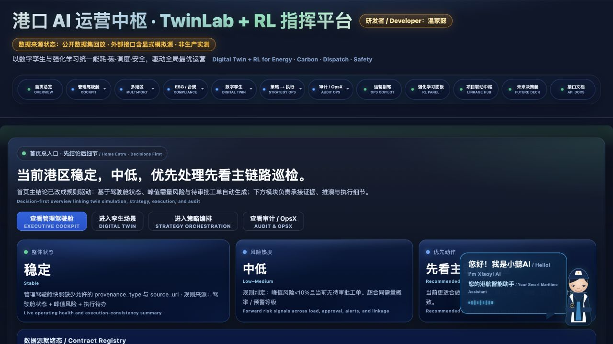
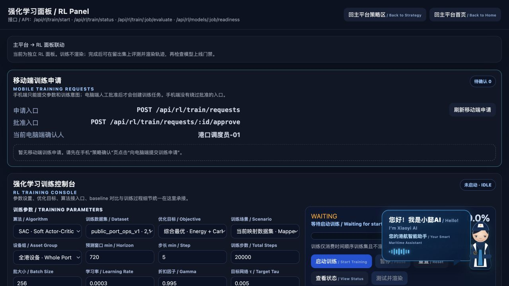

<p align="center">
  
</p>

<p align="center">
  <a href="https://github.com/wenjiayi123/port-dt-multi/actions/workflows/ci.yml"></a>
  <a href="LICENSE"></a>
  
  
  
  
</p>

<p align="center">
  <strong>可审计港口 AI 生命周期平台：从数据来源、数字孪生、真实训练和留出评测，到模型治理、受控干预与证据回放。</strong><br />
  <em>An auditable port-AI lifecycle platform spanning provenance, digital twins, real training, held-out evaluation, model governance, bounded intervention, and evidence replay.</em>
</p>

<p align="center">
  <strong>研发作者：</strong>温家懿 · <strong>Research Author:</strong> Wen Jiayi
</p>

<p align="center">
  <a href="#-系统全景--system-at-a-glance">系统全景 / Overview</a> ·
  <a href="#-快速开始--quick-start">快速开始 / Quick start</a> ·
  <a href="#-真实训练与评测--real-training--evaluation">训练与评测 / Evaluation</a> ·
  <a href="#-数据与接港契约--data--port-adapter-contract">数据契约 / Data</a> ·
  <a href="#-安全和治理边界--safety--governance-boundaries">安全治理 / Safety</a> ·
  <a href="docs/OPEN_SOURCE_READINESS_AUDIT.md">开源审计 / Audit</a>
</p>

<table>
  <tr>
    <th align="center">公开数据驱动记录<br /><sub>PUBLIC-DATA DRIVEN</sub></th>
    <th align="center">泊位有效利用率<br /><sub>BERTH UTILIZATION</sub></th>
    <th align="center">平均待泊时间<br /><sub>MEAN WAITING TIME</sub></th>
    <th align="center">情景用电成本<br /><sub>SCENARIO ENERGY COST</sub></th>
    <th align="center">稳定性复验<br /><sub>PAIRED BOOTSTRAP</sub></th>
  </tr>
  <tr>
    <td align="center"><strong>52,608</strong><br />小时记录 / hourly records</td>
    <td align="center"><strong>83.63% → 91.09%</strong><br />相对提升 / relative +8.91%</td>
    <td align="center"><strong>−16.94%</strong><br />5.90 h → 4.90 h</td>
    <td align="center"><strong>−11.80%</strong><br />同吞吐情景 / throughput held</td>
    <td align="center"><strong>365 × 2,000</strong><br />日级配对复验 / paired daily resampling</td>
  </tr>
</table>

<p align="center">
  <sub><strong>Evidence scope:</strong> parameter-declared digital-twin counterfactual over public MPA anchors; not a measured terminal KPI, online A/B test, or audited financial saving.</sub>
</p>

---

## 为什么是 Port DT Multi？ / Why Port DT Multi?

港口 AI 项目真正困难的部分，不是再画一张驾驶舱，而是让“数据从哪里来、算法究竟跑了什么、评测是否泄漏、策略为何允许进入下一道门、执行到底有没有发生”能够被复核。Port DT Multi 把这些问题组织成一条可本地运行、可替换数据源、可留存证据的工程主链。

The hard part of port AI is not another dashboard. It is making data origin, algorithm execution, leakage control, promotion criteria, action authority, and final evidence independently reviewable. Port DT Multi turns those concerns into a local, replaceable, evidence-producing engineering workflow.

| 能力域 / Domain | 已实现 / Implemented | 可审计证据 / Evidence |
|---|---|---|
| 数据与来源 / Data & provenance | 规范字段映射、质量门禁、单位/时区/许可元数据、SHA-256<br><sub>Canonical mapping, quality gates, unit/time-zone/licence metadata, and SHA-256</sub> | 数据卡、质量报告、数据集指纹<br><sub>Dataset card, quality report, and fingerprint</sub> |
| 港区孪生 / Port twin | 数据集确定性投影；可切换严格 JSONL 实体轨迹<br><sub>Deterministic dataset projection with switchable strict JSONL entity traces</sub> | 来源等级、帧序号、时间戳、适配器状态<br><sub>Provenance level, frame sequence, timestamp, and adapter status</sub> |
| 策略实验 / Policy lab | SAC、PPO、TD3、DQN + 滚动时域 MPC<br><sub>SAC, PPO, TD3, DQN plus receding-horizon MPC</sub> | 真实库版本、随机种子、配置、监控日志<br><sub>Runtime library, seed, configuration, and monitored logs</sub> |
| 独立评测 / Independent evaluation | 时间顺序留出集、多窗口评测、95% 自助法区间<br><sub>Chronological holdout, multi-window evaluation, and 95% bootstrap intervals</sub> | 每轮指标、窗口索引、轨迹回放、评测协议<br><sub>Per-run metrics, window indices, replay, and protocol</sub> |
| 模型治理 / Model governance | 模型卡、产物哈希、candidate/champion/rollback/archive | 门禁阻断项、审批人、理由、审计日志<br><sub>Blocking gates, approver, rationale, and audit log</sub> |
| 运行治理 / Operational governance | OpsX、漂移/异常、来源总览、故障响应流程<br><sub>OpsX, drift/anomaly checks, provenance overview, and incident workflow</sub> | 请求 ID、健康检查、Prometheus 指标、事件证据<br><sub>Request ID, health checks, Prometheus metrics, and incident evidence</sub> |
| 受控执行 / Bounded execution | 默认关闭；白名单、参数约束、幂等、异人复核、独立二通道<br><sub>Disabled by default; allowlist, bounds, idempotency, four-eyes review, and an independent second channel</sub> | 原子审计、失败关闭、可重试回滚<br><sub>Atomic audit, fail-closed behavior, and retry-safe rollback</sub> |
| 双语交互 / Bilingual UX | 中文/English 主界面、RL 面板、运营助手、集成中枢<br><sub>Chinese/English cockpit, RL panel, copilot, and integration hub</sub> | 页面级来源状态和能力边界<br><sub>Page-level provenance state and capability boundary</sub> |

> <strong>定位 / Positioning</strong> — 这是研究、教学、软件验证与现场集成前评估平台，不是已经认证的自主港口控制器。所有推理输出默认是建议，`dispatch_allowed=false`；生产执行权始终位于独立现场审批、设备联锁与变更管理之后。
>
> This is a research, teaching, software-verification, and pre-integration assessment platform—not a certified autonomous port controller. All inference is advisory by default with `dispatch_allowed=false`; production authority remains behind independent site approval, equipment interlocks, and change management.

## 🧭 系统全景 / System at a glance


这不是把所有模块混成一个“万能 AI”。系统通过来源等级、环境隔离、注册门禁和执行权分离，让感知、实验、评测、决策建议与设备动作各自拥有清晰责任边界。

This is not a monolithic “AI that does everything.” Provenance levels, environment isolation, registry gates, and authority separation keep sensing, experimentation, evaluation, recommendations, and equipment actuation accountable to different boundaries.

## 🖥️ 产品界面 / Product surfaces

<p align="center">
  
</p>

<p align="center">
  
</p>

- <strong>运营总览 / Operations cockpit</strong>：港区态势、数据来源、KPI、ESG/合规、策略链与审计入口。缺少正式证据时显示“未接入/未评定”，不补造优秀指标。<br>
  *Port situation, provenance, KPI, ESG/compliance, policy chain, and audit entry points. Missing formal evidence is shown as “not connected / not assessed,” never replaced with flattering metrics.*
- <strong>强化学习面板 / RL panel</strong>：选择规范数据集和五类控制器，读取后端真实进度，训练完成后再启动留出集评测与轨迹回放。<br>
  *Select a canonical dataset and one of five controllers, read backend-owned progress, and start holdout evaluation and replay only after training completes.*
- <strong>运营助手 / Ops copilot</strong>：把自然语言意图映射为受支持的只读查询或白名单候选动作；不扩大调用者权限。<br>
  *Maps natural-language intent to supported read-only queries or allowlisted candidate actions without expanding caller authority.*
- <strong>集成中枢 / Integration hub</strong>：展示现场连接、功能开关和安全门；验证链运行在 dry-run，不能冒充生产下发。<br>
  *Surfaces site connections, feature flags, and safety gates. Integration verification runs as dry-run and cannot masquerade as production dispatch.*
- <strong>Story / OpsX / TwinLab</strong>：用于证据叙事、运行治理、故障注入和接港前契约联调；每类数据保持 replay、simulation、derived、measured 标签。<br>
  *Supports evidence narratives, operational governance, fault injection, and pre-integration contract testing while preserving replay/simulation/derived/measured labels.*

## 🧠 真实训练与评测 / Real training & evaluation

五个基线使用相同规范数据契约和评测口径，但并不伪装成相同类型：SAC、PPO、TD3、DQN 由 Stable-Baselines3 实际优化；MPC 使用 SciPy 约束优化，是非学习控制基线。

All five baselines share one canonical data contract and evaluation protocol without pretending to be the same kind of method: SAC, PPO, TD3, and DQN are genuinely optimized by Stable-Baselines3; MPC is a non-learning constrained controller implemented with SciPy.

| 控制器 / Controller | 类型 / Type | 动作空间 / Action space | 实现 / Implementation |
|---|---|---|---|
| SAC | off-policy actor–critic | 连续 / continuous | `stable_baselines3.SAC` |
| PPO | on-policy policy gradient | 连续 / continuous | `stable_baselines3.PPO` |
| TD3 | off-policy actor–critic | 连续 / continuous | `stable_baselines3.TD3` |
| DQN | value-based | 离散 / discrete | `stable_baselines3.DQN` |
| MPC | rolling-horizon control | 连续约束 / constrained continuous | `scipy.optimize.minimize` |

实验隔离契约 / Experiment-isolation contract:

1. 数据按时间切分，训练段在前、测试段在后，不 shuffle。
2. 训练环境只能读训练段；`render()` 和轨迹收集在训练模式中被代码级禁止。
3. 训练完成后，由独立评测调用读取留出段；默认 10 个确定性窗口。
4. 产物记录数据哈希、配置、随机种子、实现版本、模型哈希和训练渲染调用次数。
5. 比较性结论至少需要 3 个不同随机种子；MPC 作为确定性非学习基线按相同窗口单独登记。

1. Data is split chronologically, with no shuffle.
2. The training environment sees only the training segment; rendering and trace collection are prohibited in training mode.
3. A separate evaluation call reads the holdout segment only after training, using ten deterministic windows by default.
4. Artifacts record dataset hash, configuration, seed, implementation, model hash, and training render-call count.
5. Comparative RL claims require at least three distinct seeds; deterministic MPC is registered on the same windows as a controller baseline.

## 📊 固定业务KPI对照 / Fixed business KPI evidence

Web端提供 `/api/rl/business-benchmark`，只展示经过数据、配置和计算代码 SHA-256 校验的固定反事实报告。`public_port_ops_v1` 以 MPA 新加坡 2020–2025 月度集装箱吞吐量和集装箱船到港量为官方锚点，构造 52,608 条连续小时驱动记录，并按 35,064 train / 8,784 validation / 8,760 test 时序隔离；最终测试相对“静态 FCFS + 固定能源时刻表”得到：

The Web endpoint `/api/rl/business-benchmark` exposes only the pinned counterfactual report whose data, configuration, and computation code pass SHA-256 verification. `public_port_ops_v1` anchors 52,608 consecutive hourly driver records to official MPA Singapore monthly container throughput and container-vessel arrivals for 2020–2025, then applies a chronological 35,064 train / 8,784 validation / 8,760 test split. Against static FCFS plus a fixed energy schedule, the sealed test produces:

| 指标 / Metric | 精确测试结果 / Exact test result | 简历整数口径 / Rounded resume claim |
|---|---:|---:|
| 泊位有效利用率 / Effective berth utilization | 83.63% → 91.09%，+7.45 个百分点 / percentage points | 相对 / relative +9% |
| 平均待泊时间 / Mean waiting time | 5.90 h → 4.90 h，-16.94% | -17% |
| 情景用电成本 / Scenario energy cost | 26.83M → 23.66M，-11.80% | -12% |

吞吐量保持一致；每天未恢复的柔性负荷与 BESS 期末电量按固定参考价结算，避免跨日借能或通过欠供制造节省。365 个完整测试日进行 2,000 次成对 bootstrap，三项指标的 95% 区间分别为 8.89%–8.97%、16.92%–16.97% 和 11.79%–11.84%；27 组预声明参数敏感性亦保存于报告。上述数字是公开输入驱动的数字孪生情景结果，不是港口实测 KPI、现场 A/B 或财务审计结论。完整公式、参数和边界见 [业务KPI基准](docs/BUSINESS_KPI_BENCHMARK.md) 与 [简历证据页](docs/RESUME_CLAIMS_WEB.md)。

Throughput is held constant. Unrestored flexible load and terminal BESS state of charge are settled daily at a fixed reference price to prevent cross-day energy borrowing or artificial savings through under-supply. Across 365 complete test days, 2,000 paired bootstrap resamples yield 95% intervals of 8.89%–8.97%, 16.92%–16.97%, and 11.79%–11.84%; the report also retains 27 predeclared parameter-sensitivity cases. These are public-input-driven digital-twin scenario results—not measured terminal KPIs, an online A/B test, or a financial audit. See the [business KPI benchmark](docs/BUSINESS_KPI_BENCHMARK.md) and [resume evidence page](docs/RESUME_CLAIMS_WEB.md) for formulas, parameters, and boundaries.

Flutter 移动端通过同一 FastAPI 的 `/api/mobile/*` 契约读取候选、提交人工表态、获取回执并上传审计，不是另一套独立后端。500项固定闭环操作验证了重复提交、冲突幂等键、越权生产下发与审计链，详见 [双端架构](docs/SHARED_WEB_MOBILE_ARCHITECTURE.md)、[移动闭环基准](docs/MOBILE_WORKFLOW_BENCHMARK.md)和[双端简历证据](docs/RESUME_CLAIMS_DUAL_FRONTEND.md)。

The Flutter frontend uses the same FastAPI `/api/mobile/*` contract to read candidates, submit human decisions, obtain receipts, and upload audit evidence; it is not a separate backend. A fixed suite of 500 closed-loop operations checks duplicate submissions, conflicting idempotency keys, unauthorized production dispatch, and the audit chain. See the [dual-frontend architecture](docs/SHARED_WEB_MOBILE_ARCHITECTURE.md), [mobile workflow benchmark](docs/MOBILE_WORKFLOW_BENCHMARK.md), and [dual-frontend resume evidence](docs/RESUME_CLAIMS_DUAL_FRONTEND.md).

```bash
python -m scripts.business_kpi_benchmark --verify
python -m scripts.release_check
```

## 🚀 快速开始 / Quick start

### 本地运行 / Local

Python 3.12 is recommended. / 建议使用 Python 3.12。

```bash
git clone https://github.com/wenjiayi123/port-dt-multi.git
cd port-dt-multi
python3.12 -m venv .venv
source .venv/bin/activate
python -m pip install --upgrade pip
python -m pip install -r requirements.txt
python -m uvicorn app.server:app --host 127.0.0.1 --port 8000
```

打开 / Open:

- 主界面 / Cockpit: <http://127.0.0.1:8000/>
- 强化学习面板 / RL panel: <http://127.0.0.1:8000/rl-panel>
- 运营助手 / Ops copilot: <http://127.0.0.1:8000/ops-copilot>
- 集成中枢 / Integration hub: <http://127.0.0.1:8000/integration-hub>
- OpenAPI（开发模式）: <http://127.0.0.1:8000/docs>
- 来源总览 / Provenance: <http://127.0.0.1:8000/api/system/provenance>
- 健康检查 / Health: <http://127.0.0.1:8000/health/live> · <http://127.0.0.1:8000/health/ready>

### 容器运行 / Container

```bash
docker build -t port-dt-multi:3.0.1 .
docker run --rm -p 127.0.0.1:8000:8000 port-dt-multi:3.0.1
```

容器默认以非 root 用户运行，且仍使用开发/研究边界。生产配置请从 [.env.example](.env.example) 和 [生产就绪清单](docs/PRODUCTION_READINESS.md) 开始。

The container runs as a non-root user and retains the research/integration boundary. Start production hardening from [.env.example](.env.example) and the [production-readiness checklist](docs/PRODUCTION_READINESS.md).

## 🧪 启动一次训练 / Run one experiment

```bash
curl -X POST http://127.0.0.1:8000/api/rl/train/start \
  -H 'Content-Type: application/json' \
  -d '{
    "algorithm":"sac",
    "dataset_id":"public_port_ops_v1",
    "total_steps":20000,
    "episode_steps":48,
    "test_ratio":0.2,
    "seed":42,
    "demand_cap_kw":3500
  }'
```

使用返回的 `job_id` 查询后端真实状态，并在完成后单独评测：

Use the returned `job_id` to query backend-owned progress, then evaluate separately after completion:

```bash
curl 'http://127.0.0.1:8000/api/rl/train/status?job_id=<job_id>'
curl 'http://127.0.0.1:8000/api/rl/train/<job_id>/history'
curl -X POST 'http://127.0.0.1:8000/api/rl/train/<job_id>/evaluate' \
  -H 'Content-Type: application/json' -d '{"episodes":10}'
curl 'http://127.0.0.1:8000/api/rl/models/<job_id>/readiness'
```

确定性推理返回原始动作、约束投影后的控制建议和软件安全包络；不渲染、不自动执行：

Deterministic inference returns the raw action, constrained control recommendation, and software safety envelope; it neither renders nor dispatches:

```bash
curl -X POST 'http://127.0.0.1:8000/api/rl/train/<job_id>/predict' \
  -H 'Content-Type: application/json' \
  -d '{"state":{"base_load_kw":2300,"throughput_teu":190,"vessel_arrivals":3,"tide_m":0.4,"price_per_kwh":1.1,"carbon_kg_per_kwh":0.48,"ambient_c":31,"hour":18,"soc":0.58,"queue":10,"last_bess_kw":0}}'
```

多种子正式基准 / Multi-seed benchmark:

```bash
python -m scripts.rl_benchmark \
  --dataset public_port_ops_v1 \
  --algorithms sac,ppo,td3,dqn,mpc \
  --seeds 42,142,242 \
  --steps 20000 --episodes 10
```

## 📦 数据与接港契约 / Data & port-adapter contract

规范 CSV / Canonical CSV:

```text
timestamp,base_load_kw,throughput_teu,vessel_arrivals,tide_m,price_per_kwh,carbon_kg_per_kwh,ambient_c
```

`public_port_ops_v1` 是为了复现接口、环境和测试构造的集成数据集：公开输入为新加坡海事及港务管理局 2020–2025 月度集装箱吞吐量与集装箱船到港量，官方输入的港口地理口径一致；小时负荷、小时吞吐/到港分配、分时电价、碳因子、气温和潮位压力项是有记录的确定性工程派生量，潮位项不参与三项业务 KPI。因此该数据集<strong>不是</strong>港口小时实测时序，不能用于现场绩效归因。

`public_port_ops_v1` is an integration dataset for reproducible adapters, environments, and tests. Its public inputs are MPA Singapore monthly container throughput and container-vessel arrivals for 2020–2025. Hourly load, throughput/arrival allocation, tariff, carbon, temperature and tide-stress fields are documented deterministic derivatives; tide is excluded from the three business KPIs. It is <strong>not</strong> measured hourly terminal telemetry and must not be used for site-performance attribution.

接入新港口无需改写算法，只需通过 `/api/rl/datasets/upload` 提供：

To connect another port without rewriting algorithms, upload through `/api/rl/datasets/upload` with:

- 显式字段映射 / explicit field mapping;
- `license`、`owner`、`timezone`、`intended_use` 治理元数据 / governance metadata;
- 严格递增 ISO-8601 时间和至少 48 条记录 / strictly increasing ISO-8601 timestamps and at least 48 records;
- 通过物理边界、非有限值、采样间隔和必填元数据门禁的数据 / data passing physical-bound, non-finite-value, sampling-interval, and required-metadata gates.

同名数据集默认禁止覆盖，只有显式 `replace_existing=true` 才允许替换。详细说明见 [数据与接港契约](docs/DATASET_AND_PORT_ADAPTER.md)、[数据卡](docs/DATASET_CARD_public_port_ops_v1.md) 和 [数据血缘](docs/RL_DATA_LINEAGE.md)。

Datasets cannot overwrite an existing identifier unless `replace_existing=true` is explicitly supplied. See the [dataset and port-adapter contract](docs/DATASET_AND_PORT_ADAPTER.md), [dataset card](docs/DATASET_CARD_public_port_ops_v1.md), and [RL data lineage](docs/RL_DATA_LINEAGE.md).

## 🛡️ 安全和治理边界 / Safety & governance boundaries

- <strong>来源不混淆 / No provenance blur</strong>：`dataset`、`engineering_simulator`、`live_rest`、`measured` 是不同等级；真实接口失败不会静默生成业务值。<br>
  *`dataset`, `engineering_simulator`, `live_rest`, and `measured` are distinct levels; a failed live interface never silently generates business values.*
- <strong>模型不越权 / Models have no authority</strong>：模型注册、`champion` 别名和软件包络都不是现场部署批准。<br>
  *Registration, a `champion` alias, and a software envelope do not constitute site deployment approval.*
- <strong>执行失败关闭 / Execution fails closed</strong>：南向网关默认禁用；启用后仍需资产/动作白名单、参数上下界、幂等键、异人确认和独立二通道密钥。<br>
  *The southbound gateway is disabled by default and, when enabled, still requires asset/action allowlists, parameter bounds, idempotency, four-eyes confirmation, and an independent second-channel key.*
- <strong>生产认证分离 / Certification is external</strong>：ESG、合规、孪生保真度和安全指标只有在提供正式证据时才成立，软件输出不构成法律、财务或安全认证。<br>
  *ESG, compliance, twin fidelity, and safety claims require formal evidence; software output is not legal, financial, or safety certification.*
- <strong>生产模式门禁 / Production gate</strong>：`PORT_DT_ENV=production` 时 API 需要长密钥、显式 CORS；数据覆盖、模型晋级/回滚和执行变更另需独立管理员密钥；Swagger 默认关闭。<br>
  *With `PORT_DT_ENV=production`, APIs require strong keys and explicit CORS; dataset replacement, model promotion/rollback, and execution changes require a separate administrator key; Swagger is disabled.*
- <strong>标识符安全 / Identifier safety</strong>：训练、评测和模型目录只接受受限标识符，并拒绝路径穿越与符号链接逃逸。<br>
  *Training, evaluation, and model directories accept constrained identifiers and reject path traversal and symlink escape.*

进一步阅读 / Further reading:

- [模型治理 / Model governance](MODEL_GOVERNANCE.md)
- [南向执行安全契约 / Southbound execution](docs/SOUTHBOUND_EXECUTION.md)
- [生产就绪 / Production readiness](docs/PRODUCTION_READINESS.md)
- [故障响应 / Incident response](docs/INCIDENT_RESPONSE_RUNBOOK.md)
- [安全策略 / Security policy](SECURITY.md)

## 🔌 可选集成与功能开关 / Optional integrations & feature flags

默认启动只开放可信主链；旧工程模拟器、旧 RL 产物、本机应用联动和生产执行都必须显式开启。完整变量见 [.env.example](.env.example)。

The default runtime exposes the trusted core only. Legacy engineering simulators, legacy RL artifacts, local desktop launchers, and production execution require explicit opt-in. See [.env.example](.env.example).

| 变量 / Variable | 作用 / Purpose | 默认 / Default |
|---|---|---|
| `PORT_DT_ENABLE_ENGINEERING_SIMULATORS` | 旧 Dashlets / OpsX / PortX 等界面联调模拟器<br><sub>Legacy Dashlets/OpsX/PortX UI-integration simulators</sub> | off |
| `PORT_DT_ENABLE_LEGACY_RL` | 旧 RL 模块只读查看，不用于结论<br><sub>Read-only legacy RL view, excluded from claims</sub> | off |
| `PORT_DT_ENABLE_DESKTOP_INTEGRATIONS` | 小懿/航行模拟器本机联动<br><sub>Local Xiaoyi/sailing-simulator integration</sub> | off |
| `PORT_DT_TWIN_GRAPH_PATH` | 现场孪生实体关系图<br><sub>Site twin entity graph</sub> | unset |
| `PORT_DT_TWIN_CALIBRATION_PATH` | 现场校准证据<br><sub>Site calibration evidence</sub> | unset |
| `PORT_DT_ACTUATOR_CONFIG` | 私有南向执行配置<br><sub>Private southbound execution configuration</sub> | unset |
| `PORT_DT_ALLOW_MODEL_PROMOTION` | 允许通过门禁后设置 champion<br><sub>Permit gated promotion to champion</sub> | off |

## 🗂️ 仓库结构 / Repository map

```text
app/
├── adapters/                 # telemetry, REST and actuator boundaries
├── services/rl_training/     # dataset, environment, trainers, evaluation, registry
├── services/portviz/         # deterministic/replayed port visualization sources
├── services/twin_schema/     # DTDL-compatible graph and calibration evidence
├── services/execution/       # bounded execution contracts
├── ui/                       # bilingual cockpit, RL panel, copilot, integration hub
├── operations.py             # auth, CORS, headers, health and metrics
└── server.py                 # FastAPI composition root
config/                       # safe example contracts, never site secrets
data/rl/datasets/             # redistributable integration dataset + metadata
docs/                         # architecture, data, RL, governance and runbooks
scripts/                      # dataset regeneration and auditable benchmarks
tests/                        # provenance, isolation, security and maturity regression
```

## ✅ 验证 / Verification

```bash
python -m compileall -q app scripts tests
python -m unittest discover -s tests -v
python -m scripts.rl_smoke_test --steps 64
```

当前发布门禁覆盖 44 项单元测试，并用 64 步烟雾实验真实执行 SAC、PPO、TD3、DQN 与 MPC。CI 还执行依赖漏洞审计；公开后启用 CodeQL、Dependency Review、OpenSSF Scorecard、SBOM 与源码证明。

The current gate contains 44 unit tests and a 64-step smoke experiment that genuinely executes SAC, PPO, TD3, DQN, and MPC. CI also audits installed dependencies; public-only workflows add CodeQL, Dependency Review, OpenSSF Scorecard, SBOM generation, and source attestations.

## 🤝 参与项目 / Contributing

欢迎提交来源清楚、可复现、能说明安全影响的改进。请先阅读 [贡献指南](CONTRIBUTING.md)、[治理规则](GOVERNANCE.md)、[行为准则](CODE_OF_CONDUCT.md) 和 [支持范围](SUPPORT.md)。PR 模板会要求填写数据来源、训练/评测边界、回滚方案与验证证据。

Contributions should be provenance-aware, reproducible, and explicit about safety impact. Read the [contribution guide](CONTRIBUTING.md), [governance](GOVERNANCE.md), [code of conduct](CODE_OF_CONDUCT.md), and [support policy](SUPPORT.md). The pull-request template asks for data, evaluation, rollback, and verification evidence.

安全问题请不要提交公开 Issue；请使用 GitHub Private Vulnerability Reporting。/ Do not disclose vulnerabilities in public issues; use GitHub Private Vulnerability Reporting.

## 📄 许可证与引用 / License & citation

源代码和仓库原生视觉资产使用 [MIT License](LICENSE)；公开数据仍遵循各自来源条款，详见 [THIRD_PARTY_NOTICES.md](THIRD_PARTY_NOTICES.md) 与[数据卡](docs/DATASET_CARD_public_port_ops_v1.md)。<br>
Source code and repository-native visual assets are released under the [MIT License](LICENSE). Public data retains its source terms; see [THIRD_PARTY_NOTICES.md](THIRD_PARTY_NOTICES.md) and the [dataset card](docs/DATASET_CARD_public_port_ops_v1.md).

用于研究或教学时，请通过 [CITATION.cff](CITATION.cff) 引用具体软件版本，并分别引用原始数据集。<br>
If this repository supports research or teaching, cite the versioned software release through [CITATION.cff](CITATION.cff) and cite the original datasets independently.

---

<p align="center">
  <strong>Build evidence before authority. / 先建立证据，再授予权限。</strong>
</p>
