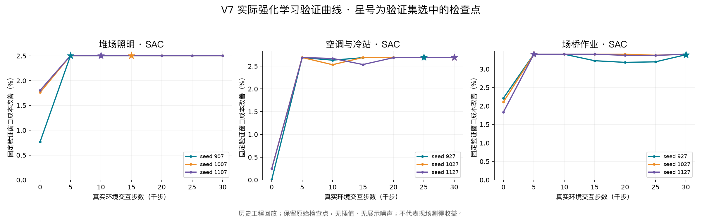

# 强化学习收敛与业务价值复核（2026-09-07）

本轮只处理强化学习训练、评估和模型接口。结论是：照明、空调、场桥已新增通过三种子验收的真实 SAC 策略；联合业务继续使用原 V6 SAC；岸电与储能的综合候选经过重训仍未通过，不替换已保留策略。自动导引运输车补做 IQL 训练诊断，但尚无可证明车队业务收益的闭环评估。不能将本次结果描述为“所有强化学习模块均已收敛”。

本轮完成 15 组实验、45 个随机种子运行，累计 1,800,000 个真实环境交互步、469,500 次优化更新（包含自动导引运输车的 30,000 次离线 IQL 更新）。全部选中模型的哈希已逐一复核，失败运行也保留模型和原始曲线。

## 可以复核的业务结果

以下是验证集预先选模后，在时间顺序保留段重新评估的结果。每个模块均为 3 个种子、每种子 30,000 个真实环境交互步，具有优化器更新、初始策略、六个训练检查点、模型哈希和逐窗口业务指标。

| 模块 | 成本改善 | 能耗改善 | 碳排改善 | 峰值改善 | 服务约束 | 不重叠评估窗口 |
|---|---:|---:|---:|---:|---|---|
| 堆场照明 | 1.8191% | 2.2251% | 2.2250% | 1.2793% | 最低照度及关键区域照度全部通过 | 5 × 8 小时 |
| 空调与冷站 | 2.6599% | 2.9537% | 2.9508% | 1.8697% | 冷却服务满足率 100% | 5 × 48 小时 |
| 场桥作业 | 3.3576% | 4.3353% | 4.3332% | 0.8111% | 作业量及作业承诺保持 100% | 5 × 48 小时 |

成本改善的窗口均值 95% 自助法置信区间依次为 1.6357%—1.9950%、2.6518%—2.6680%、3.1464%—3.6102%。这是少量工程回放窗口中的统计区间，不能当作跨港泛化或现场收益保证。

这些是各专项的独立回放结果，不能将三个百分比直接相加为全港收益；共同运行时的功率、作业量和结算收益仍须由联合环境统一核算。

上述对比基准是同一环境中的历史运行基准。另以完全相同的窗口复测原有蒸馏模型：空调成本再改善约 0.0772%，场桥再改善约 0.4583%；照明比原模型高约 0.0012%，业务表现基本持平。照明本次的新增价值是把教师蒸馏替换为可复核的独立强化学习训练证据，不能把全部 1.8191% 都说成相对原模型新增的节省。



原始数据入口：

- `evidence/v7/audit_summary.json`：全部完成实验与训练量、通过模块、保留边界。
- `evidence/v7/<模块>/runs/<运行编号>/report.json`：每种子指标、置信区间和失败门禁。
- 同目录 `seed_*/curve.json`、`monitor.csv`：真实验证检查点和训练回报；选中模型的公开包通过 `evidence/v7/public_models/manifest.json` 映射。
- `evidence/v7/runtime_verification.json`：实际接口推理、原仿真接口接续、同窗口旧策略比较和候选拦截回执。

公开包包含所有 45 个种子运行的选中模型、原始训练与验证曲线、失败报告、AGV 合成输入快照和联合续训所需的历史种子模型。42 个新 SB3 模型及两个历史续训种子以 44 份公开包发布：仅移除包含本机路径、加载时可重建的学习率/探索率调度缓存，网络与优化器成员逐字节不变，逐模型 32 个观测的推理输出及四个进度点的调度数值完全一致。三个 AGV 模型保留原始 JSON 权重。原始训练压缩包、中间检查点权重和原始报告均保留，报告哈希不改写；公开包通过训练模型 SHA-256 映射。公开曲线记录各检查点指标与哈希，重训可重新生成中间权重。[AGV 输入来源说明](AGV_V7_SYNTHETIC_DATA.md)。

## 查出的原因和修改

1. 通用训练回调在最后一步返回 `False`，导致最后一次交互未被存入回放缓冲区，或 PPO 最后一批采样未进入优化器。现在由算法自身完成步数预算，并记录实际优化次数；64 步 PPO 回归验证确认模型确实执行优化，而非只保存初始网络。训练监控文件也会正确关闭。
2. 旧自动导引运输车、空调、储能脚本存在展示噪声、按训练进度制造收益形状、奖励偏置等处理。已移除活动脚本中的这些处理。空调的奖励偏置还进入了价值网络目标，导致训练目标随训练步数变化，本轮一并去除。历史文件保持原样，不能再作为真实收敛证明。
3. 自动导引运输车将奖励整体加 3 后又按奖励正负强化动作，混淆了业务优劣；默认关闭此类额外动作推高项，保留 IQL 优势加权更新。归一化改为双精度统计，对近常数特征使用单位尺度，避免星期、目标电量特征被放大到异常数量级。
4. 岸电 PPO 加载旧蒸馏模型时，没有落实新配置中的学习率、熵系数；实际步数也曾按请求值累计。现在显式覆盖加载参数、记录真实步数，并在打开前向评估前冻结种子，避免按前向结果挑冠军。
5. 空调、场桥、照明原先主要证明教师动作拟合。现在新增从随机初始化出发、直接进行环境交互和 SAC 更新的训练，奖励围绕动作能改变的成本、能耗、服务和峰值构造，降低外部固定负荷对学习信号的干扰。原物理和服务约束继续由共同仿真环境检查。
6. 原部分专项的多个长评估窗口存在重叠。新增流程只用不重叠窗口；空调和场桥首轮由于完整长窗口数量不足被保留为未准入，随后以明确的 48 小时窗口重新训练、评估，不把重叠窗口数冒充独立样本数。
7. 储能的软峰值目标会在期末恢复荷电状态后再次截断充电，破坏已经满足的期末电量约束。已修复约束顺序、增加绝对期末误差与待补电量指标，并用零期末容差档案重新训练。修复后若恢复电量造成峰值或碳排变差，会如实计入结果。
8. 岸电延后负荷属于待偿还的能量债务。训练中的状态势函数现在同时记录电池库存和柔性负荷欠账，减轻“当前少用电、期末集中补回”的错误激励；不修改核算结果来制造收益。
9. 旧岸桥轻量引擎把平均标准差命名为 KL。已改为同一批状态下更新前后高斯策略的实际 KL。该轻量实现仍按轻量实现保留，不冒称标准 SAC 或完整 TD3。

## 仍未解决的强化学习问题

### 岸电与储能综合目标

已保留多轮 SAC、带精确零动作的 DQN、不同碳排与峰值奖励权重，以及严格期末恢复实验。它们仍未稳定同时满足成本、碳排、峰值和多种子门禁。曲线平坦而业务退步的模型不计为合格收敛。

训练数据中的电价和小时碳强度是声明过的工程派生量：电价范围 0.43—1.08 元/千瓦时，碳强度范围 0.54—0.59 千克/千瓦时，两者相关系数约 -0.676。低电价充电、高电价放电很容易同时带来碳排回退；充放电损耗和期末补电进一步压缩收益。更换成 DQN 后可以选择精确零动作，但这不能凭空产生正收益。

这并不证明所有综合 RL 策略都数学上不可行；只证明本次训练和已声明环境下的候选未达门槛。后续需要授权的分时边际碳因子、岸电计量、电池管理系统效率与温度曲线、结算需量以及真实工作日跨度，继续进行约束强化学习与前瞻评估。仅延长训练或降低门槛不能替代这些证据。

### 自动导引运输车与旧岸桥专项

自动导引运输车新增 3 种子 × 10,000 次 IQL 优化，采用按时间分割和跨分割转换剔除，记录固定验证集的贝尔曼误差、动作差异及原始批次指标。旧行为数据的下一状态不能证明新充电动作下的车队电量、充电桩拥堵、作业截止时间或港区实测峰值，因此仍不做业务准入，也不替换原模型。

联合 V6 SAC 已覆盖岸桥资源分配和水平运输资源分配；这不等于旧 14 维岸桥轻量模型或逐车充电模型已经通过独立业务验收。逐车充电与岸桥设备级接口仍需各自的动作效果标定和闭环评估。

## 模型切换接口

新增接口不需要改变已训练的观测维度和动作维度：

```text
GET  /api/rl/business-v7/evidence
POST /api/rl/business-v7/{module}/predict
```

可用模块是 `yard_lighting`、`hvac`、`yard_crane`、`coordinated_business`。联合模块在 V7 续训未通过时明确加载原 V6 SAC，不改用其他控制算法。岸电和储能在没有准入 RL 模型时返回 409。

证据接口分别返回最新实验与当前准入冠军，避免把失败的新实验当作正在使用的模型。后续专项训练即使通过基准，也必须在同窗口比较中证明可靠新增成本收益，且碳排、峰值的置信区间不明显退步，才会替换已有 V7 冠军。

请求包含已按对应训练集规范归一化的 `observation`，可携带 `expected_model_sha256` 固定模型版本。响应包含动作、模型哈希、证据哈希和业务模块；模型或报告哈希不一致、维度不符、越界、非有限输入都会拒绝。

`model_sha256` 与 `expected_model_sha256` 标识原始训练档案，保持与不可变报告一致；`loaded_artifact_sha256` 和 `loaded_artifact_path` 明确标识实际加载的公开模型包。公开导出映射与内容哈希不符时拒绝加载。

Python 调用可直接复用现有环境的转换：

```python
from app.services.rl_training.business_runtime import BusinessRLPolicy

policy = BusinessRLPolicy("yard_crane", expected_model_sha256=verified_model_hash)
observation, info = env.reset()
action, _ = policy.predict(observation, deterministic=True)
observation, reward, terminated, truncated, info = env.step(action)
```

“可切换”是指经过验收的离线 RL 模型能够沿用软件观测与动作接口；现场更换数据仍必须匹配字段、单位、采样频率、归一化、资产参数和缺失掩码，并经过现场标定与影子验证。目前保持 `simulation_mode=true`、`live_data_verified=false`、`dispatch_allowed=false`、`production_authority=false`。模型不能自行取得生产执行权。

## 重现和验证

独立发布目录完整回归通过 283 项，包含 10 项专项测试；此前开发工作区的 288 项结果另行保留，其中 5 项属于本次不发布的已有移动接口延迟改动。实际 HTTP 推理、原仿真环境接续、版本核验、失败候选拦截均通过。发布回执为 [`evidence/v7/verification.json`](../evidence/v7/verification.json)，其中记录测试耗时、日志哈希、当前代码哈希以及 45 个选中模型的逐项哈希核验。

```bash
.venv312/bin/python -m scripts.train_business_rl_v7 --module yard_lighting
.venv312/bin/python -m scripts.train_business_rl_v7 --module hvac --episode-steps 192 --learning-rate 0.0001 --entropy 0.001 --peak-multiplier 4 --steps 30000 --seeds 927,1027,1127
.venv312/bin/python -m scripts.train_business_rl_v7 --module yard_crane --episode-steps 192 --learning-rate 0.0001 --entropy 0.001 --peak-multiplier 4 --steps 30000 --seeds 927,1027,1127
.venv312/bin/python -m scripts.audit_agv_iql_v7
.venv312/bin/python -m scripts.verify_business_rl_v7
.venv312/bin/python -m scripts.verify_business_rl_artifacts_v7
.venv312/bin/python -m unittest discover -s tests -v
```

所有历史模型、旧冠军指针和失败实验均保留；新运行使用唯一目录。这里的历史评估段和 2026 公开前向数据已经被过去实验使用过，所以明确称为重复基准评估，不声称新的封存盲测。需要新的未见场景或现场影子数据才能进一步验证泛化。

方法核对：[Stable-Baselines3 回调与提前停止说明](https://stable-baselines3.readthedocs.io/en/v2.4.1/guide/callbacks.html)、[强化学习评估与多种子建议](https://stable-baselines3.readthedocs.io/en/master/guide/rl_tips.html)。
