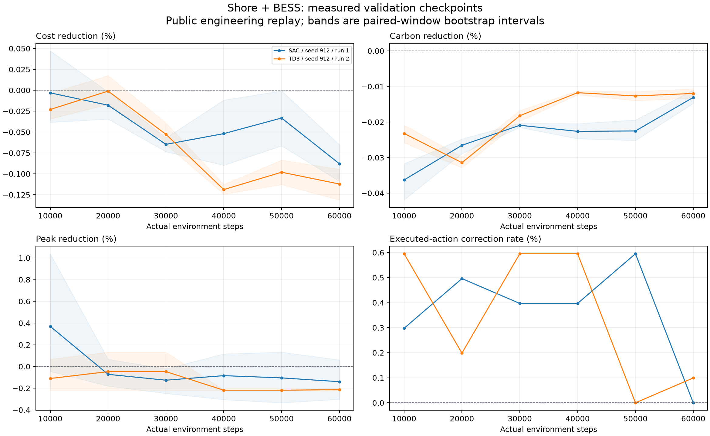

# 岸电储能：SAC / TD3 重训结果

**截至本轮结束，没有训练出同时降本、减碳、降峰并通过准入的神经策略。** SAC 与 TD3 均实际训练完成；现有证据不足以认定其中一种普遍更好。原增碳结果、原数据、历史模型及本轮失败检查点完整保留。

## 同数据、同环境步数的最终对照

标准 SAC、标准 TD3 各随机初始化训练 **60,000 步**，同 seed 912、31维状态、2维动作、128×128隐层、训练段归一化、原设备效率及固定λ16。SAC发生58,000次actor和58,000次critic更新；TD3为29,000次actor和58,000次critic更新。相同环境步数不等于相同优化器次数或运行时间。

以下为相对零动作基线的**增加百分比**，取预先约定的最终60k检查点。未挑选中途最好结果；六个固定168小时验证窗口，单种子。区间是配对周窗口均值bootstrap 95% CI，不代表现场保证或跨随机种子置信区间。

| 算法 | 成本增加 | 碳排增加 | 峰值增加 | 综合门槛 |
|---|---:|---:|---:|---|
| SAC | 0.087951% [0.065030, 0.108983] | 0.013083% [0.011062, 0.014781] | 0.140405% [−0.060391, 0.301536] | 未通过 |
| TD3 | 0.112202% [0.094537, 0.131228] | 0.011973% [0.010632, 0.013357] | 0.213407% [0.202276, 0.220899] | 未通过 |

SAC的点估计成本退化较少，TD3的点估计增碳较少；这不能建立稳健的算法优劣排序。两者在这些验证窗口中都增碳，因此没有打开重复测试或独立前向文件进行策略评估，也没有进入三种子正式准入。完整历史CSV曾被加载和质量检查，后段未用于训练、归一化或选型；不能宣称程序从未读到这些CSV字节。

图中“reduction”为降低量，负数表示增加；阴影为窗口均值区间，折线只连接真实检查点，没有补造训练样本。

## 找到并处理的问题

- **截图对应教师蒸馏。** 原V3.1优化的是教师动作MSE，保存模型的RL交互计数为零。“3/3收敛”代表模仿稳定，不能证明RL减碳。
- **数据与损耗使套利增碳。** 原场景低价时段碳因子较高，储能还存在7.84%的往返能量损耗。原年化252.433565吨增碳已逐项复算，约61%来自损耗，其余主要是充放电碳强度错配。电价、碳因子和负荷是公开数据校准的工程特征，非上海港逐小时实测。
- **软目标没有保证减碳。** 训练集理想LP中，λ12在6周里有5周仍偏好增碳。依据训练段扫描选择λ16，仍保留成本、碳、峰值及逐窗非增碳的独立验收门槛。乘子是约束权重，不能解释为实际碳交易价格。登记文件如实披露写入发生在训练启动后。
- **执行误罚与截止期。** V8加入12小时FIFO期限、周末库存结清、真实需量账单、31维因果状态及训练段尺度；修复float32物理功率交接造成的约0.216W边界误罚和双向制动可行域。原数据、设备效率及物理违约容差保持不变。
- **区分不同神经网络失败。** 多步TD3曾出现两维动作全部饱和、tanh梯度为零；该候选已保留为失败记录。最终标准SAC/TD3的训练探针未出现整体梯度失效，但仍存在无效电池循环，不能将所有失败归因于同一问题。

仅控制柔性负荷、BESS待机的另一项30k步SAC诊断取得验证降本0.073858%、降峰0.409665%，但碳仍增加0.001644%。它也被拒绝，不能代替完整岸电储能的减碳成果。LP和规则基线均单独列示，未记入神经网络收益。

## 证据与交付

V8相关 **92项测试通过**。120集、20,160步边界压力验证中，物理、SOC、FIFO和末端库存违规均为零。最终两组模型各有357个完整训练回合（59,976步）的独立账本核验；各自末尾24步尚未构成完整回合，完整回合统计不覆盖它们。选中与最终模型均重载并精确复现六个验证窗口。

本地验证页已展示两组最终检查点、真实更新次数、负指标及置信区间，历史V3.1明确标记为历史增碳策略。诊断展示不构成新冠军、模型在线接管或生产准入。

- [最终机器可读对照](../evidence/v8/shore_bess/audits/r5-final-comparison-20260912.json)
- [SAC独立核验](../evidence/v8/shore_bess/audits/sac-standard-r5-independent-audit-20260912.json) · [TD3独立核验](../evidence/v8/shore_bess/audits/td3-standard-r5-independent-audit-20260912.json)
- [增碳根因与训练集可行性](SHORE_BESS_V8_ROOT_CAUSE.md) · [完整探索记录](SHORE_BESS_V8_TRAINING_DIAGNOSTICS.md) · [复现命令](SHORE_BESS_V8_REPRODUCIBILITY.md)

所有结果限于公开数据校准的离线工程回放。本轮没有获得可宣称的现场减排或利润，也没有达到用户要求的联合达标减碳模型。
